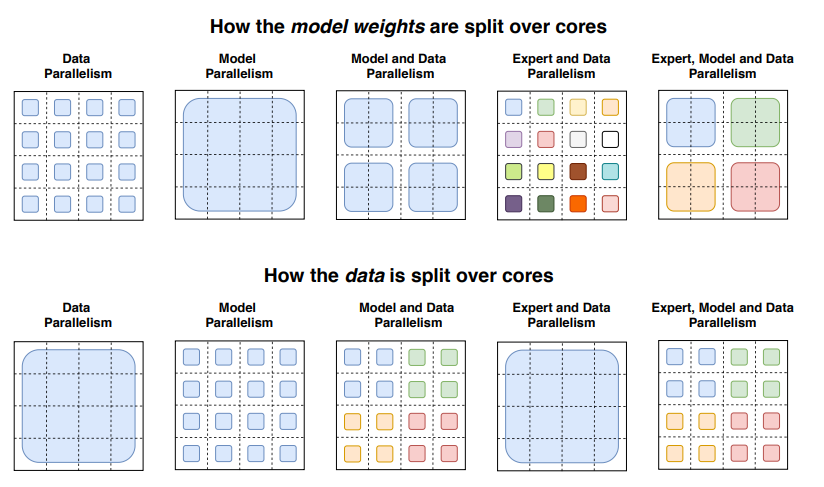

```
^\s*\n to delete empty newline
```
## Lecture 1
https://stanford-cs336.github.io/spring2025-lectures/?trace=var/traces/lecture_01.json
Of course. Here is a preview for your lecture session based on the materials provided.
### Summary
Today's session introduces the rationale for building language models from scratch: to gain a fundamental understanding in an era where models are increasingly large, proprietary, and abstracted away. The lecture argues that "efficiency"—achieving maximum performance for a given resource budget—is the core principle driving modern LM development. It provides a historical overview of LMs, from early neural networks to today's frontier models, and outlines the course's structure. The session then dives into the first key technical component: tokenization. It contrasts different strategies (character, byte, word-based) and details the widely-used Byte-Pair Encoding (BPE) algorithm, which intelligently creates a vocabulary by merging frequent byte sequences from a training corpus.
### Key Concepts
-   **Building from Scratch**: The course philosophy of implementing models from the ground up to gain deep, transferable insights into their mechanics and design.
-   **Efficiency as a Core Principle**: The central idea that maximizing performance for a given data and compute budget drives almost all design decisions in the LM pipeline.
-   **Tokenization**: The crucial first step in any language model pipeline that converts raw text strings into sequences of integer tokens.
-   **Byte-Pair Encoding (BPE)**: A data-driven algorithm that trains a tokenizer by starting with single bytes and iteratively merging the most frequent adjacent pairs.
### Guiding Questions
1.  **Why** is a deep, "from-scratch" understanding of model mechanics still critical for innovation when state-of-the-art progress seems dominated by massive-scale industrial efforts?
2.  **How** does the goal of maximizing "efficiency" create trade-offs and influence design decisions at every level, from tokenization to model architecture and training strategy?
3.  **What-if** we could build effective models that operate directly on raw bytes, bypassing tokenization entirely? What challenges would this solve, and what new ones might it create?
4.  **How** do the different methods of tokenization (character, word, BPE) represent different trade-offs between vocabulary size, sequence length, and the ability to handle rare or new words?
### Warm-up
**Q1**
In the Byte-Pair Encoding (BPE) training algorithm, what is the primary criterion for deciding which pair of tokens to merge into a new token at each step?
   (a) The alphabetical order of the token pair.
   (b) The length of the resulting merged token.
   (c) The frequency of the adjacent token pair in the corpus.
   (d) A pre-defined list of important subwords.
**A1**
(c) The frequency of the adjacent token pair in the corpus. BPE is a greedy algorithm that iteratively finds the most common adjacent pair of tokens and merges them.
**Q2**
Fill in the blanks: A pure byte-based tokenizer has a small, fixed vocabulary size of \_\_\_\_, but it produces very \_\_\_\_ token sequences, which is computationally inefficient for Transformer models.
**A2**
256, long.
**Q3**
You are training a BPE tokenizer on the text: `unusual_users`. The initial sequence of byte tokens is `['u', 'n', 'u', 's', 'u', 'a', 'l', '_', 'u', 's', 'e', 'r', 's']`. The most frequent adjacent pair is `('u', 's')`. What will the token sequence be after performing this single merge?
**A3**
The new sequence will be `['u', 'n', 'z', 'u', 'a', 'l', '_', 'z', 'e', 'r', 's']`, where `z` is the new token representing `us`.
Of course. Here is a review guide to help you consolidate and apply the concepts from the lecture.
### 1. Quick Quiz
**Q1**: The lecture states that today's researchers are becoming "disconnected" from the underlying technology. What is the course's proposed solution to this problem?
**A1**: The course's solution is "understanding via building." By implementing models from scratch, students can gain a fundamental understanding of the mechanics and mindset that transfer even to frontier-scale models.
**Q2**: What is the key difference between the "prefill" and "decode" phases of inference, and which one is typically "memory-bound"?
**A2**: In the **prefill** phase, the model processes the entire prompt at once, which is compute-bound. In the **decode** phase, the model generates one token at a time, which is memory-bound due to the need to constantly access the large KV cache.
**Q3**: According to the lecture, what is the core trade-off that Byte-Pair Encoding (BPE) is designed to solve, compared to pure word-based or byte-based tokenization?
**A3**: BPE solves the trade-off between vocabulary size and sequence length. Word-based tokenizers have huge vocabularies and struggle with new words, while byte-based tokenizers have tiny vocabularies but create excessively long sequences. BPE finds a middle ground.
**Q4**: What are the three levels of "openness" for language models described in the lecture?
**A4**: 
1.  **Closed models** (API access only, e.g., GPT-4o).
2.  **Open-weight models** (weights available, but not data or full training details, e.g., Llama).
3.  **Open-source models** (weights, data, and code are public, e.g., OLMo).
### 2. Concept Network
This network shows how the lecture's core ideas connect. `A → B` means A influences or leads to B. `A ↔ B` means they have a reciprocal or trade-off relationship.
-   **Core Goal: Efficiency** (Best model for a given compute/data budget)
    -   `Efficiency` → Drives all **Design Decisions**.
    -   `Efficiency` ↔ **Scaling Laws** (Scaling laws predict the most efficient allocation of compute).
        -   `Chinchilla's Law` → Recommends optimal `Model Size (N)` vs. `Data Size (D)`.
    -   `Efficiency` → Requires **Hardware-Aware Implementation** (Systems).
        -   `Hardware (GPU)` → Motivates **Custom Kernels** (Triton) & **Parallelism** (Data, Tensor, etc.).
-   **Design Decisions Pipeline**:
    -   **1. Data Curation & Processing** → Filters for high-quality data to avoid wasting compute.
    -   **2. Tokenization**
        -   `Tokenization` ↔ `Sequence Length` vs. `Vocabulary Size` (The core dilemma).
        -   `Byte-Pair Encoding (BPE)` → A practical solution that adapts vocabulary to the data.
    -   **3. Model Architecture**
        -   `Transformer` → Core building block.
        -   `Architectural Variants` (RoPE, SwiGLU, RMSNorm) → Often motivated by improving computational or memory `Efficiency`.
    -   **4. Training** (Optimizer, LR Schedule) → Fine-tunes the process of achieving model convergence efficiently.
    -   **5. Alignment** (SFT, DPO) → Makes the base model more useful, which can be seen as improving its sample `Efficiency` for desired tasks.
### 3. Typical Pitfalls
1.  **Confusing BPE Encoding with Training**: During BPE training, pair frequencies are repeatedly calculated to build the merge rules. However, when *encoding* a new string with a trained tokenizer, you simply apply the fixed, pre-learned merge rules in order—you don't re-calculate any frequencies.
2.  **Misinterpreting "The Bitter Lesson"**: A common mistake is thinking the lesson is "scale is all you need." The lecture clarifies the correct interpretation: *algorithms that scale efficiently* are what truly matter. Algorithmic improvements are even more critical at large scales where waste is prohibitively expensive.
3.  **Underestimating Data Processing**: The lecture shows a sample of raw Common Crawl data to emphasize that high-quality data is not a given. It's easy to think of training data as a clean text file, but in reality, enormous effort goes into cleaning, filtering, and deduplicating raw sources like webpages, a crucial step for efficient training.
### 4. Micro-Application
**Task:**
You are building a BPE tokenizer. Your training corpus is the simple string: `"low lower lowest"`. Perform the first two merge steps of the BPE training algorithm. Start from the initial sequence of UTF-8 byte tokens.
**Hints / Sample Solution:**
**Initial State:**
The string `"low lower lowest"` is first converted to bytes and then to a list of integer tokens. For simplicity, let's represent them as characters:
`['l', 'o', 'w', ' ', 'l', 'o', 'w', 'e', 'r', ' ', 'l', 'o', 'w', 'e', 's', 't']`
**Step 1: Find and perform the first merge.**
1.  **Count adjacent pairs**:
    -   `(l, o)`: 3 times
    -   `(o, w)`: 3 times
    -   `(w, ' ')`: 1 time
    -   `(' ', l)`: 2 times
    -   `(w, e)`: 2 times
    -   `(e, r)`: 1 time
    -   `(r, ' ')`: 1 time
    -   `(e, s)`: 1 time
    -   `(s, t)`: 1 time
2.  **Find the most frequent pair**: `(l, o)` and `(o, w)` are tied with 3 occurrences. Let's break the tie by choosing the one that appeared first: `(l, o)`.
3.  **Merge**: We create a new token, let's call it `Z`, to represent `lo`.
4.  **New sequence**:
    `['Z', 'w', ' ', 'Z', 'w', 'e', 'r', ' ', 'Z', 'w', 'e', 's', 't']`
**Step 2: Find and perform the second merge.**
1.  **Count new adjacent pairs**:
    -   `(Z, w)`: 3 times
    -   `(w, ' ')`: 1 time
    -   `(' ', Z)`: 2 times
    -   `(w, e)`: 2 times
    -   `(e, r)`: 1 time
    -   `(r, ' ')`: 1 time
    -   `(e, s)`: 1 time
    -   `(s, t)`: 1 time
2.  **Find the most frequent pair**: `(Z, w)` is the most frequent with 3 occurrences.
3.  **Merge**: We create a new token, `Y`, to represent `Zw` (which is `low`).
4.  **New sequence**:
    `['Y', ' ', 'Y', 'e', 'r', ' ', 'Y', 'e', 's', 't']`
After two steps, the tokenizer has learned to represent `"lo"` and `"low"` as single tokens.
Of course. Based on the lecture materials provided in `lecture_01.py`, here is a summary and comparison of the different tokenization algorithms discussed.
The lecture presents four main approaches to tokenization, framing them as a series of trade-offs between vocabulary size, sequence length, and the ability to handle any possible text.
| Algorithm | How It Works | Strengths | Weaknesses |
| :--- | :--- | :--- | :--- |
| **1. Character Tokenizer** | Each unique Unicode character is mapped to its integer code point (e.g., `ord('a')`). | - Conceptually simple.<br>- Lossless: can represent any character exactly. | - **Huge Vocabulary**: ~150,000 possible tokens, which is inefficient.<br>- **Poor Compression**: One character becomes one token, leading to long sequences. |
| **2. Byte Tokenizer** | The string is encoded into bytes (using UTF-8), and each byte (an integer from 0-255) becomes a token. | - **Small, Fixed Vocabulary**: Exactly 256 tokens, which is very efficient.<br>- **Complete**: Can represent any text string without "unknown" tokens. | - **Terrible Compression**: The token sequence is as long as the number of bytes, leading to very long sequences that are difficult for models to process. |
| **3. Word Tokenizer** | The text is split into words using rules or regular expressions. Each unique word becomes a token. | - **Intuitive**: Aligns well with how humans process language.<br>- **Good Compression**: Sequences are short (one token per word). | - **Huge & Unbounded Vocabulary**: The number of words is massive.<br>- **Out-of-Vocabulary Problem**: Requires a special `<UNK>` token for new words, which loses information. |
| **4. Byte-Pair Encoding (BPE)** | **A hybrid, data-driven algorithm.**<br>1. **Initialize** with single-byte tokens.<br>2. **Iteratively merge** the most frequent adjacent pair of tokens in a training corpus into a single new token.<br>3. **Repeat** for a set number of merges to build the final vocabulary. | - **Best of Both Worlds**: Balances vocabulary size and sequence length for good compression.<br>- **No Unknown Tokens**: Can fall back to byte-level representation for any new word.<br>- **Adaptive**: Vocabulary is optimized for the specific data it was trained on. | - **It's a "necessary evil"**: Framed as a practical but potentially inelegant workaround for current model limitations.<br>- **Greedy Algorithm**: The merges are locally optimal at each step, not necessarily globally optimal for the entire corpus. |
The lecture also briefly mentions **Tokenizer-Free Approaches** (e.g., `byt5`, `megabyte`) which operate directly on bytes. These are described as promising but not yet scaled to the level of frontier models, positioning **BPE** as the dominant, practical solution used today.
## Lecture 2
https://stanford-cs336.github.io/spring2025-lectures/?trace=var/traces/lecture_02.json
Of course! Here is your course preview based on the provided materials.
Why backpropagation takes 4 FLOPs: https://medium.com/@dzmitrybahdanau/the-flops-calculus-of-language-model-training-3b19c1f025e4
### Summary
This session provides a bottom-up guide to the primitives of model training, with a strong emphasis on resource accounting for memory and compute. Starting with tensors, it explores the memory implications of data types like float32 and bfloat16. The lecture then dives into compute costs (FLOPs) for key operations like matrix multiplication and backpropagation, introducing concepts like Model FLOPs Utilization (MFU). You'll learn to construct PyTorch models, implement custom optimizers, and build a complete training loop. The session also covers practical best practices, including efficient data loading, checkpointing for fault tolerance, and mixed-precision training to balance speed and stability.
### Key Concepts
-   **Resource Accounting**: Quantifying the memory (bytes) and compute (FLOPs) required for training models.
-   **Floating-Point Precision**: Understanding trade-offs between `float32`, `bfloat16`, and `float16` for memory, speed, and numerical stability.
-   **Tensor Operations & Einops**: Manipulating tensors efficiently and using `einops` for readable, error-proof dimension handling.
-   **FLOPs Calculation**: Estimating the computational cost of forward and backward passes (e.g., ~6 × parameters × tokens).
-   **PyTorch `nn.Module`**: Building custom models by composing layers and managing parameters.
-   **Training Loop Components**: Implementing optimizers, data loaders, checkpointing, and mixed-precision training.
### Guiding Questions
1.  **Why** is `bfloat16` often preferred over `float16` in modern LLM training, despite both using 16 bits of memory per parameter?
2.  **How** does the "6 × parameters × tokens" rule of thumb for training FLOPs arise from the costs of the forward and backward passes?
3.  **What-if** you are training a model and the Model FLOPs Utilization (MFU) is very low? What could be the potential bottlenecks?
4.  **How** do design choices like optimizer (e.g., Adam vs. SGD) and model architecture affect the total memory footprint during training, beyond just parameter count?
### Warm-up
**Q1 (Fill-in-the-blank)**
A 10B parameter model is trained on 1T tokens. The total training compute is approximately \_\_\_\_\_\_ FLOPs.
**A1**
6e22 FLOPs. The lecture establishes that total FLOPs are roughly 6 × (number of parameters) × (number of tokens), so 6 × 10e9 × 1e12 = 6e22.
**Q2 (Multiple-Choice)**
You are using the Adam optimizer to train a model with 1 billion parameters using `float32` precision. Naively, how much GPU memory is required for just the parameters, gradients, and optimizer state (ignoring activations)?
a) ~4 GB
b) ~8 GB
c) ~12 GB
d) ~16 GB
**A2**
d) 16 GB. For each parameter, we store: 4 bytes for the parameter itself, 4 bytes for its gradient, and 8 bytes for Adam's optimizer state (4 for momentum, 4 for variance). Total = (4 + 4 + 8) bytes/param × 1e9 params = 16e9 bytes ≈ 16 GB.
**Q3 (Mini-code)**
You have a tensor `x` with shape `(batch, seq_len, hidden_dim)`. Write a single line of code using `einsum` to calculate the dot product attention scores between all pairs of vectors in the sequence, resulting in a tensor of shape `(batch, seq_len, seq_len)`.
**A3**
`scores = einsum(x, x, "b s1 d, b s2 d -> b s1 s2")`
Of course. Here is your active recall and transfer review.
### 1. Quick Quiz
**Q1:** According to the lecture's rule of thumb, the backward pass requires approximately how many times more FLOPs than the forward pass for a standard dense model?
**A1:** The backward pass requires roughly **twice** the FLOPs of the forward pass (4 * N * P vs. 2 * N * P, where N is tokens and P is parameters).
**Q2:** If you use `x.transpose(1, 0)` to create a new tensor `y` from `x`, does modifying an element in `x` (e.g., `x[0, 0] = 100`) also change `y`? Why or why not?
**A2:** **Yes**, `y` will be changed. `transpose()` creates a **view**, not a copy, of the original tensor. Both `x` and `y` point to the same underlying memory storage, so a change via one tensor is visible in the other.
**Q3:** What is the primary benefit of using `bfloat16` over `float16` for deep learning, given they both use 16 bits?
**A3:** `bfloat16` has the same **dynamic range** as `float32` (8 exponent bits), which prevents numerical underflow/overflow on very small or large numbers, providing more training stability than `float16`. The trade-off is lower precision (fewer mantissa bits).
**Q4:** When switching from an `SGD` optimizer to `AdaGrad`, what additional memory cost per parameter is introduced, and what is stored?
**A4:** `AdaGrad` adds optimizer state. For each parameter, it stores a running sum of the squares of its gradients. If using `float32`, this adds **4 bytes per parameter** to the memory footprint.
### 2. Concept Network
-   **Resource Accounting (Memory & FLOPs)** is the central theme that connects all concepts.
    -   It is driven by **Hardware** (`A100`/`H100` specs) and measured by **Model FLOPs Utilization (MFU)**.
-   **Memory Accounting** ↔ **Tensor `dtype`** (`float32`, `bfloat16`, `fp8`)
    -   Memory for a model is determined by the size of **Parameters**, **Gradients**, **Activations**, and **Optimizer State**.
    -   **Mixed Precision Training** is a technique to optimize this trade-off.
-   **Compute Accounting (FLOPs)** ↔ **Tensor Operations**
    -   Dominated by **Matrix Multiplication** (`@` or `einsum`).
    -   FLOPs for training ≈ **6 × #parameters × #tokens**, comprising the **Forward Pass** (~2NP) and **Backward Pass** (~4NP).
-   **Tensors** are the fundamental data structure.
    -   Their memory layout is defined by **Storage and Strides**.
    -   Manipulated via **Slicing/Views** (cheap) or **Copies** (expensive).
    -   Complex manipulations are made easier by **`einops`** (`rearrange`, `reduce`, `einsum`).
-   **`nn.Module`** is the building block for models.
    -   It contains **`nn.Parameter`** objects, which require careful **Initialization** to ensure training stability.
-   **Training Loop** combines everything:
    -   It iterates over batches from a **Data Loader**.
    -   Performs a forward pass through the **Model** to get a loss.
    -   Performs a backward pass (`loss.backward()`) to compute **Gradients**.
    -   Uses an **Optimizer** (`SGD`, `AdaGrad`) to update parameters.
    -   Relies on **Checkpointing** for fault tolerance.
### 3. Typical Pitfalls
1.  **Confusing FLOPs and FLOP/s:** Mistaking the total amount of computation (FLOPs) with the speed of computation (FLOP/s or FLOPS). The first is a quantity, the second is a rate.
2.  **Ignoring Activation Memory:** Forgetting that intermediate activations, especially in models with long sequence lengths or large batch sizes, consume significant GPU memory. Calculations that only account for parameters, gradients, and optimizer state will underestimate the true memory requirement.
3.  **Silent Bugs from Tensor Views:** Accidentally modifying a tensor when you thought you were working with a copy because an operation returned a view (like `transpose`, `view`, or slicing). This can lead to bugs that are very hard to trace. Always use `.clone()` or `.contiguous()` when you explicitly need a new copy.
4.  **Underestimating Backward Pass Cost:** Assuming the backward pass has the same computational cost as the forward pass. As the lecture details, it's approximately twice as expensive in FLOPs, which is critical for accurate training time estimates.
### 4. Micro-Application
**Task:**
You are asked to plan a fine-tuning run for a 7-billion-parameter language model on a single H100 GPU (80 GB VRAM). Your goal is to fine-tune it on a 20-billion-token dataset. The training will use mixed precision.
1.  **Memory Check:** You plan to use the AdamW optimizer. For memory efficiency, you'll store the model parameters and gradients in `bfloat16`. However, AdamW maintains a `float32` copy of the parameters for stable updates. Calculate the total memory required for the **model state** (parameters, gradients, optimizer state) and determine if it will fit on the H100.
2.  **Compute & Time Estimate:** Estimate the total FLOPs required for the entire fine-tuning run. Then, using the H100's `bfloat16` performance from the lecture and assuming a realistic Model FLOPs Utilization (MFU) of 50%, calculate the estimated training time in days.
**Hints / Sample Solution:**
1.  **Memory Calculation:**
    -   Parameters (`bfloat16`): 7e9 params × 2 bytes/param = 14 GB
    -   Gradients (`bfloat16`): 7e9 params × 2 bytes/param = 14 GB
    -   AdamW Optimizer State (momentum + variance, both `bfloat16`): 2 × 7e9 params × 2 bytes/param = 28 GB
    -   AdamW `float32` copy of parameters: 7e9 params × 4 bytes/param = 28 GB
    -   **Total State Memory:** 14 + 14 + 28 + 28 = **84 GB**.
    -   **Conclusion:** This will **not fit** on a single 80 GB H100. This calculation doesn't even include memory for activations, highlighting the need for memory-saving techniques like ZeRO.
2.  **Compute & Time Calculation:**
    -   **Total FLOPs:** 6 × #params × #tokens = 6 × 7e9 × 20e9 = 8.4e20 FLOPs.
    -   **H100 Performance (from lecture):** The peak `bfloat16` FLOP/s for a dense H100 is `1979e12 / 2 = 989.5e12` FLOP/s.
    -   **Effective FLOP/s:** Peak FLOP/s × MFU = 989.5e12 × 0.50 = 494.75e12 FLOP/s.
    -   **Total Time (seconds):** Total FLOPs / Effective FLOP/s = 8.4e20 / 494.75e12 ≈ 1.7e6 seconds.
    -   **Total Time (days):** 1.7e6 seconds / (60 sec/min × 60 min/hr × 24 hr/day) ≈ **19.7 days**.
## Lecture 3
This Lecture talk about the Transformer's training.
I think before taking this class, first learn about transformer.
https://web.stanford.edu/class/cs224n/
https://web.stanford.edu/class/cs224n/slides_w25/cs224n-2025-lecture08-transformers.pdf
https://web.stanford.edu/class/cs224n/readings/cs224n-self-attention-transformers-2023_draft.pdf
### Summary  
Lecture 3 of CS336 delves into the common architecture variations and hyperparameters of large language models (LLMs), focusing on what aspects are shared and what varies among state-of-the-art transformers. It covers key design choices such as pre-norm vs post-norm LayerNorm, RMSNorm vs LayerNorm, and the role of bias terms. The lecture explains various activation functions including ReLU, GeLU, and gated linear units like SwiGLU, highlighting their empirical effects. It also explores serial versus parallel transformer layers and the rationale behind rotary position embeddings (RoPE) for relative positional encoding. Hyperparameters such as feedforward dimension ratios, number of attention heads, model depth vs width, vocabulary sizes, and regularization strategies are analyzed with empirical evidence from many modern models. Finally, the session discusses stability tricks like z-loss and QK norm for softmax stability and attention head optimizations such as multi-query and group-query attention to reduce inference costs. The lecture emphasizes learning from a broad survey of recent LLMs to inform design decisions[1].
### Key Concepts  
- Pre-norm LayerNorm improves gradient flow and training stability.  
- RMSNorm is a faster alternative to LayerNorm without mean subtraction.  
- Gated linear units (GLUs) like SwiGLU enhance feedforward networks.  
- Rotary position embeddings (RoPE) encode relative positions via rotations.  
- Feedforward dimension typically 4× model dimension; GLUs use ~2.67×.  
- Most models maintain head_dim × num_heads ≈ model_dim ratio.  
- Serial transformer layers are standard; parallel layers can speed training.  
- Vocabulary size varies: 30-50k for monolingual, 100k+ for multilingual.  
- Regularization (weight decay) affects optimization dynamics more than overfitting.  
- Stability tricks: z-loss for output softmax, QK norm for attention softmax.  
- Attention head optimizations: Multi-Query Attention (MQA), Group-Query Attention (GQA).  
### Guiding Questions  
1. Why do most modern LLMs prefer pre-norm over post-norm LayerNorm?  
2. How do rotary position embeddings (RoPE) improve relative position encoding compared to sine or absolute embeddings?  
3. What are the trade-offs between serial and parallel transformer layer designs?  
4. How does the choice of activation function, especially gated linear units, impact model performance and efficiency?  
5. What hyperparameter ratios (feedforward size, head dimensions) are empirically optimal for large-scale transformers?  
### Warm-up  
**Q1:** What is the main difference between pre-norm and post-norm transformer architectures?  
**A1:** Pre-norm applies LayerNorm before the attention and feedforward blocks, improving gradient flow and stability; post-norm applies LayerNorm after residual addition.  
**Q2:** Fill in the blank: Rotary position embeddings (RoPE) encode positional information by applying ________ to query and key vectors.  
**A2:** rotations (in 2D coordinate pairs) using sine and cosine functions.  
**Q3:** Which activation function is commonly used in recent LLMs like LLaMA and PaLM that involves gating?  
a) ReLU  
b) GeLU  
c) SwiGLU  
**A3:** c) SwiGLU, a gated linear unit combining swish and GLU mechanisms.
### 1. Quick Quiz  
**Q1:** What is the primary advantage of using pre-norm LayerNorm over post-norm in transformer architectures?  
**A1:** Pre-norm improves gradient flow and training stability, reducing gradient spikes and enabling larger learning rates.  
**Q2:** How do rotary position embeddings (RoPE) differ from absolute or sine positional embeddings?  
**A2:** RoPE encodes relative positions by rotating query and key vectors in 2D coordinate pairs, preserving relative position invariance without additive cross terms.  
**Q3:** What is the typical ratio of feedforward dimension (d_ff) to model dimension (d_model) in large language models, and how does this change with GLU activations?  
**A3:** Typically d_ff ≈ 4 × d_model; for GLU variants, d_ff is scaled down to about 8/3 × d_model (~2.67×).  
**Q4:** What stability tricks are used to prevent softmax instability in large transformers?  
**A4:** Z-loss stabilizes output softmax; QK norm stabilizes attention softmax by normalizing query and key vectors.  
**Q5:** What are Multi-Query Attention (MQA) and Group-Query Attention (GQA), and why are they used?  
**A5:** MQA reduces key/value dimensions to save memory and speed inference; GQA balances expressiveness and efficiency by grouping queries.  
---
### 2. Concept Network  
- **Pre-norm LayerNorm** ↔ improves → **Gradient Stability** ↔ enables → **Larger Learning Rates**  
- **LayerNorm vs RMSNorm** ↔ trade-off → **Compute Efficiency** and **Parameter Count**  
- **Activation Functions** ↔ include → **ReLU, GeLU, SwiGLU (GLU variants)** ↔ impact → **Model Performance and Efficiency**  
- **Rotary Position Embeddings (RoPE)** ↔ encode → **Relative Positions** ↔ improve → **Position Invariance in Attention**  
- **Feedforward Dimension (d_ff)** ↔ proportional to → **Model Dimension (d_model)** ↔ affects → **Model Capacity**  
- **Attention Heads** ↔ number and size → affect → **Model Expressiveness and Compute Cost**  
- **Stability Tricks (Z-loss, QK norm)** ↔ mitigate → **Softmax Instability** ↔ improve → **Training Stability**  
- **Parallel vs Serial Transformer Layers** ↔ trade-off → **Training Speed vs Model Quality**  
- **MQA/GQA** ↔ optimize → **Inference Efficiency** ↔ by reducing → **KV Cache Memory**  
### 3. Typical Pitfalls  
1. Confusing pre-norm and post-norm LayerNorm placement and their impact on gradient flow and training stability.  
2. Misunderstanding positional embeddings: assuming absolute or sine embeddings are relative, unlike RoPE which ensures relative positional invariance.  
3. Ignoring the importance of the feedforward dimension ratio, leading to suboptimal model capacity or efficiency.  
4. Overlooking stability tricks like z-loss and QK norm, resulting in unstable softmax computations and training failures.  
5. Underestimating the computational and memory costs of attention heads, especially during incremental text generation without MQA/GQA optimizations.  
### 4. Micro-Application  
**Task:**  
Implement a small transformer block in PyTorch that uses pre-norm LayerNorm, SwiGLU activation in the feedforward network, and applies rotary position embeddings (RoPE) to the query and key vectors. Use dummy input data to verify the forward pass runs without errors. Then, experiment by switching the LayerNorm to post-norm and observe any differences in training stability or output variance over several iterations.
**Hints / Sample Solution:**  
- Use `torch.nn.LayerNorm` before attention and feedforward layers for pre-norm.  
- Implement SwiGLU as two linear layers with a swish gating mechanism: $$ \text{SwiGLU}(x) = (xW_1) \times \sigma(xW_2) $$.  
- For RoPE, pair up query/key dimensions and apply sine/cosine rotations based on position indices.  
- Compare pre-norm and post-norm by training on a simple toy task (e.g., sequence prediction) and monitoring gradient norms and loss curves.  
- Expect pre-norm to show smoother gradients and more stable loss decrease.  
This exercise reinforces understanding of core architectural choices and their practical impact on model behavior.
## Lecture 4
**Basic Concept of MoE: https://huggingface.co/blog/moe**

### Summary  
Lecture 4 of CS336 focuses on Mixture of Experts (MoE), a neural network architecture that improves model efficiency and scalability by activating only a subset of specialized sub-models ("experts") per input token. The session explains how MoEs replace the dense feed-forward layers in transformers with multiple expert networks and a routing mechanism (the gating network) that selects which experts to activate. This sparse activation allows models to scale parameters massively without increasing computation proportionally, enabling faster training and inference. The lecture covers routing strategies like top-k token choice, training challenges such as load balancing and instability, and practical solutions including auxiliary balancing losses and router z-loss. It also discusses recent state-of-the-art MoE architectures like DeepSeek and Llama 4, highlighting their expert routing setups and training techniques such as upcycling from dense models. The session concludes with system-level considerations for parallelism and the benefits and limitations of MoEs in modern large language models.
### Key Concepts  
- Mixture of Experts (MoE) architecture activates sparse expert sub-networks dynamically.  
- Experts replace dense feed-forward layers in transformers for scalability.  
- Routing (gating) networks select top-k experts per token for processing.  
- Load balancing losses ensure even expert utilization during training.  
- Router z-loss improves numerical stability of gating softmax.  
- Upcycling initializes MoEs from pretrained dense models.  
- MoEs enable model and data parallelism across devices.  
- Training MoEs involves managing sparsity and routing non-differentiability.  
- Recent MoEs like DeepSeek v3 use fine-grained expert segmentation and shared experts.  
### Guiding Questions  
1. How does sparse activation in MoEs improve training efficiency compared to dense models?  
2. Why is the gating network critical for MoE performance and how does it decide expert assignment?  
3. What are the main challenges in training MoEs and how do balancing losses and z-loss address them?  
4. How do recent MoE architectures like DeepSeek improve upon earlier designs?  
5. What are the trade-offs of using MoEs in terms of infrastructure complexity and model stability?  
### Warm-up  
**Q1 (Multiple Choice):**  
What is the main role of the gating network in a Mixture of Experts model?  
A) Train all experts simultaneously  
B) Select which experts process each input token  
C) Combine outputs of all experts equally  
D) Increase the model’s parameter count  
**A1:** B) Select which experts process each input token  
**Q2 (Fill-in-the-Blank):**  
In MoE models, the feed-forward layer is replaced by multiple ______ that are activated sparsely per input token.  
**A2:** experts  
**Q3 (Short Answer):**  
Why do MoE models typically use top-k routing for expert selection?  
**A3:** Top-k routing selects the k experts with the highest routing scores per token, balancing exploration and load, and simplifying routing decisions for efficient sparse activation.
### 1. Quick Quiz  
**Q1:** What is the main architectural difference between a dense transformer model and a Mixture of Experts (MoE) model?  
**A1:** Dense models use fully activated feed-forward layers for every token, while MoE models replace FFNs with multiple expert networks but activate only a few experts per token via a routing mechanism.  
**Q2:** Why is top-k routing commonly used in MoE models?  
**A2:** Top-k routing selects the k experts with the highest routing scores per token, balancing efficient sparse activation and load distribution.  
**Q3:** What is the purpose of load balancing losses in training MoEs?  
**A3:** Load balancing losses encourage even utilization of all experts to prevent some experts from being overloaded while others are underused, improving training stability and efficiency.  
**Q4:** How does MoE enable scaling to larger parameter counts without proportional increases in computation?  
**A4:** By activating only a small subset of experts per token, MoEs increase total parameters but keep active computation per token low, enabling large model capacity with efficient computation.  
**Q5:** What is the role of the router z-loss in MoE training?  
**A5:** Router z-loss improves numerical stability of the gating softmax by preventing large roundoff errors in floating-point calculations during routing.  
### 2. Concept Network  
- **Dense Transformer** ↔ **Feed-Forward Network (FFN)** (fully activated for all tokens)  
- **MoE Model** ↔ **Sparse FFN Experts** (multiple FFNs, sparse activation)  
- **Routing Network (Gating)** ↔ **Top-k Routing** (selects experts per token)  
- **Load Balancing Loss** ↔ **Expert Utilization** (ensures even load across experts)  
- **Router z-loss** ↔ **Numerical Stability** (stabilizes softmax in routing)  
- **Upcycling** ↔ **Pretrained Dense Model Initialization** (used to initialize MoE experts)  
- **Parallelism** ↔ **Expert, Model, Data Parallelism** (enables scaling MoE training)  
- **Training Challenges** ↔ **Non-differentiable Routing, Instability** (addressed by heuristics and auxiliary losses)  
### 3. Typical Pitfalls  
1. **Confusing total parameters with active parameters:** MoEs have many parameters but only activate a few experts per token, so compute cost is much lower than total parameter count suggests.  
2. **Assuming routing is fully differentiable:** Routing decisions are discrete and not differentiable, so training relies on heuristics like stochastic perturbations and balancing losses rather than pure gradient descent.  
3. **Ignoring load imbalance:** Without load balancing losses, some experts become overloaded while others are rarely used, causing training instability and inefficiency.  
4. **Overfitting in fine-tuning sparse MoEs:** Sparse models can overfit smaller fine-tuning datasets if not carefully managed.  
5. **Underestimating infrastructure complexity:** MoEs require complex multi-device parallelism and communication patterns, which can be challenging to implement efficiently.  
### 4. Micro-Application  
**Task:**  
Given a small transformer model with 4 layers, hidden size $$ d=512 $$, and FFN expansion factor 4, design a simple MoE layer to replace the dense FFN in one transformer block. Assume you have 8 experts and use top-2 routing per token. Calculate and compare the number of active parameters used per token in the dense FFN vs. the MoE FFN.  
**Hints / Sample Solution:**  
- Dense FFN parameters per layer: $$ 2 \times d \times 4d = 8d^2 = 8 \times 512^2 = 2,097,152 $$ parameters.  
- MoE total FFN parameters: $$ 8 \times 2,097,152 = 16,777,216 $$ parameters (8 experts).  
- Active experts per token: 2, so active parameters per token: $$ 2 \times 2,097,152 = 4,194,304 $$.  
- Compare: Dense uses ~2 million FFN parameters per token; MoE activates ~4 million but can scale total parameters much higher without increasing per-token compute beyond this.  
- This exercise illustrates how MoEs trade off total parameter count for sparse activation, enabling larger capacity with manageable compute.