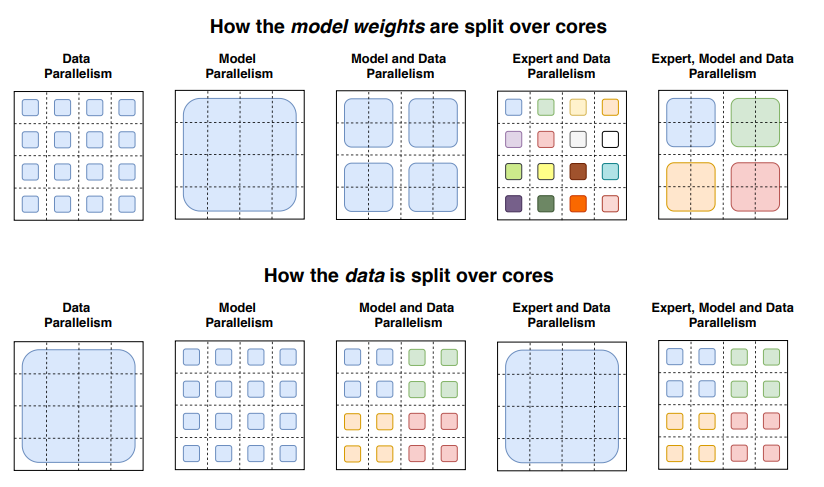
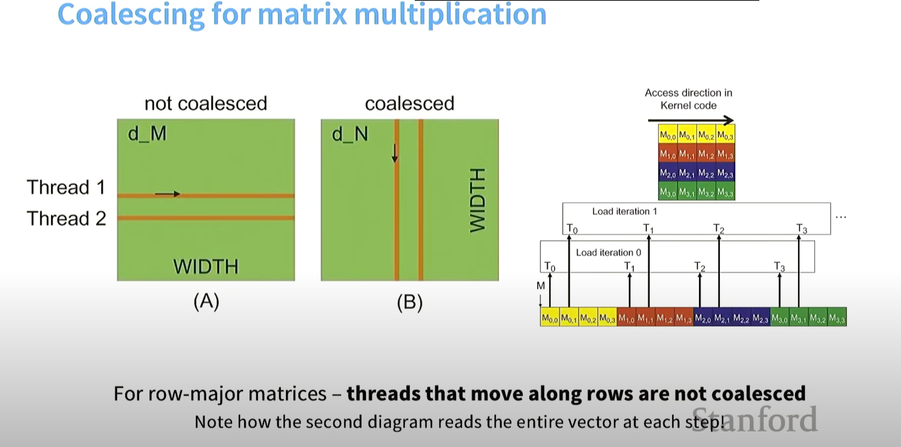
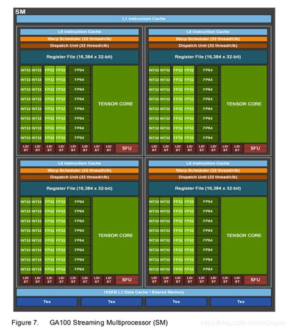
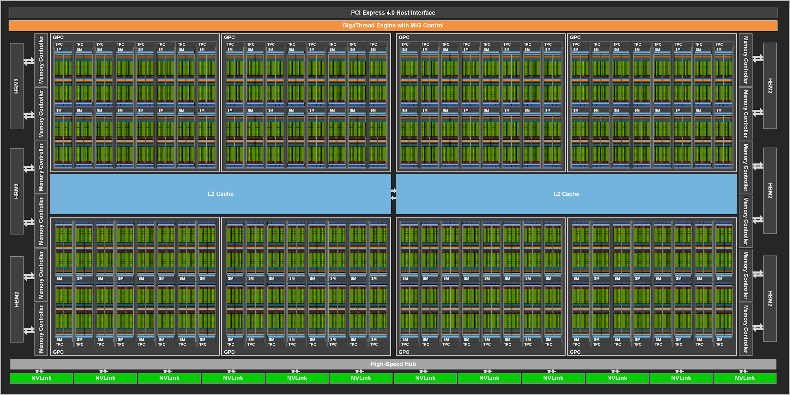
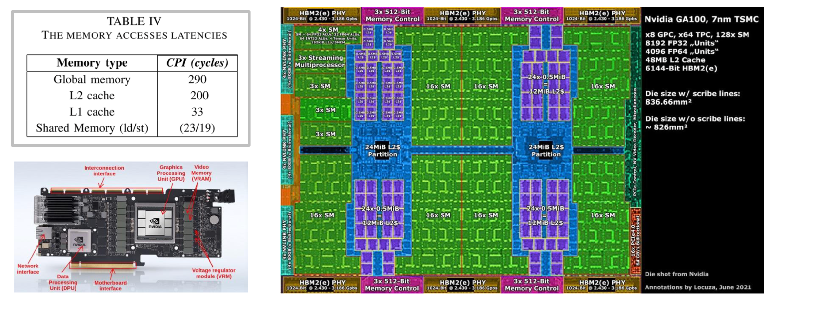
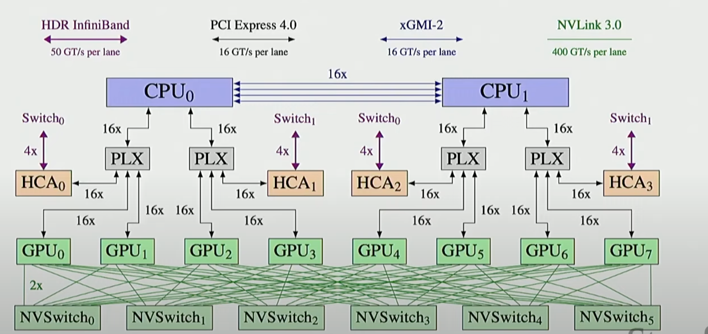
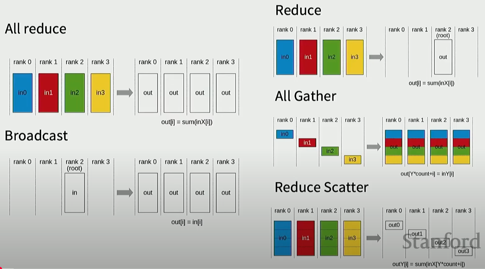

```
^\s*\n to delete empty newline
```
## Lecture 1
https://stanford-cs336.github.io/spring2025-lectures/?trace=var/traces/lecture_01.json
Of course. Here is a preview for your lecture session based on the materials provided.
### Summary
Today's session introduces the rationale for building language models from scratch: to gain a fundamental understanding in an era where models are increasingly large, proprietary, and abstracted away. The lecture argues that "efficiency"—achieving maximum performance for a given resource budget—is the core principle driving modern LM development. It provides a historical overview of LMs, from early neural networks to today's frontier models, and outlines the course's structure. The session then dives into the first key technical component: tokenization. It contrasts different strategies (character, byte, word-based) and details the widely-used Byte-Pair Encoding (BPE) algorithm, which intelligently creates a vocabulary by merging frequent byte sequences from a training corpus.
### Key Concepts
-   **Building from Scratch**: The course philosophy of implementing models from the ground up to gain deep, transferable insights into their mechanics and design.
-   **Efficiency as a Core Principle**: The central idea that maximizing performance for a given data and compute budget drives almost all design decisions in the LM pipeline.
-   **Tokenization**: The crucial first step in any language model pipeline that converts raw text strings into sequences of integer tokens.
-   **Byte-Pair Encoding (BPE)**: A data-driven algorithm that trains a tokenizer by starting with single bytes and iteratively merging the most frequent adjacent pairs.
### Guiding Questions
1.  **Why** is a deep, "from-scratch" understanding of model mechanics still critical for innovation when state-of-the-art progress seems dominated by massive-scale industrial efforts?
2.  **How** does the goal of maximizing "efficiency" create trade-offs and influence design decisions at every level, from tokenization to model architecture and training strategy?
3.  **What-if** we could build effective models that operate directly on raw bytes, bypassing tokenization entirely? What challenges would this solve, and what new ones might it create?
4.  **How** do the different methods of tokenization (character, word, BPE) represent different trade-offs between vocabulary size, sequence length, and the ability to handle rare or new words?
### Warm-up
**Q1**
In the Byte-Pair Encoding (BPE) training algorithm, what is the primary criterion for deciding which pair of tokens to merge into a new token at each step?
   (a) The alphabetical order of the token pair.
   (b) The length of the resulting merged token.
   (c) The frequency of the adjacent token pair in the corpus.
   (d) A pre-defined list of important subwords.
**A1**
(c) The frequency of the adjacent token pair in the corpus. BPE is a greedy algorithm that iteratively finds the most common adjacent pair of tokens and merges them.
**Q2**
Fill in the blanks: A pure byte-based tokenizer has a small, fixed vocabulary size of \_\_\_\_, but it produces very \_\_\_\_ token sequences, which is computationally inefficient for Transformer models.
**A2**
256, long.
**Q3**
You are training a BPE tokenizer on the text: `unusual_users`. The initial sequence of byte tokens is `['u', 'n', 'u', 's', 'u', 'a', 'l', '_', 'u', 's', 'e', 'r', 's']`. The most frequent adjacent pair is `('u', 's')`. What will the token sequence be after performing this single merge?
**A3**
The new sequence will be `['u', 'n', 'z', 'u', 'a', 'l', '_', 'z', 'e', 'r', 's']`, where `z` is the new token representing `us`.
Of course. Here is a review guide to help you consolidate and apply the concepts from the lecture.
### 1. Quick Quiz
**Q1**: The lecture states that today's researchers are becoming "disconnected" from the underlying technology. What is the course's proposed solution to this problem?
**A1**: The course's solution is "understanding via building." By implementing models from scratch, students can gain a fundamental understanding of the mechanics and mindset that transfer even to frontier-scale models.
**Q2**: What is the key difference between the "prefill" and "decode" phases of inference, and which one is typically "memory-bound"?
**A2**: In the **prefill** phase, the model processes the entire prompt at once, which is compute-bound. In the **decode** phase, the model generates one token at a time, which is memory-bound due to the need to constantly access the large KV cache.
**Q3**: According to the lecture, what is the core trade-off that Byte-Pair Encoding (BPE) is designed to solve, compared to pure word-based or byte-based tokenization?
**A3**: BPE solves the trade-off between vocabulary size and sequence length. Word-based tokenizers have huge vocabularies and struggle with new words, while byte-based tokenizers have tiny vocabularies but create excessively long sequences. BPE finds a middle ground.
**Q4**: What are the three levels of "openness" for language models described in the lecture?
**A4**: 
1.  **Closed models** (API access only, e.g., GPT-4o).
2.  **Open-weight models** (weights available, but not data or full training details, e.g., Llama).
3.  **Open-source models** (weights, data, and code are public, e.g., OLMo).
### 2. Concept Network
This network shows how the lecture's core ideas connect. `A → B` means A influences or leads to B. `A ↔ B` means they have a reciprocal or trade-off relationship.
-   **Core Goal: Efficiency** (Best model for a given compute/data budget)
    -   `Efficiency` → Drives all **Design Decisions**.
    -   `Efficiency` ↔ **Scaling Laws** (Scaling laws predict the most efficient allocation of compute).
        -   `Chinchilla's Law` → Recommends optimal `Model Size (N)` vs. `Data Size (D)`.
    -   `Efficiency` → Requires **Hardware-Aware Implementation** (Systems).
        -   `Hardware (GPU)` → Motivates **Custom Kernels** (Triton) & **Parallelism** (Data, Tensor, etc.).
-   **Design Decisions Pipeline**:
    -   **1. Data Curation & Processing** → Filters for high-quality data to avoid wasting compute.
    -   **2. Tokenization**
        -   `Tokenization` ↔ `Sequence Length` vs. `Vocabulary Size` (The core dilemma).
        -   `Byte-Pair Encoding (BPE)` → A practical solution that adapts vocabulary to the data.
    -   **3. Model Architecture**
        -   `Transformer` → Core building block.
        -   `Architectural Variants` (RoPE, SwiGLU, RMSNorm) → Often motivated by improving computational or memory `Efficiency`.
    -   **4. Training** (Optimizer, LR Schedule) → Fine-tunes the process of achieving model convergence efficiently.
    -   **5. Alignment** (SFT, DPO) → Makes the base model more useful, which can be seen as improving its sample `Efficiency` for desired tasks.
### 3. Typical Pitfalls
1.  **Confusing BPE Encoding with Training**: During BPE training, pair frequencies are repeatedly calculated to build the merge rules. However, when *encoding* a new string with a trained tokenizer, you simply apply the fixed, pre-learned merge rules in order—you don't re-calculate any frequencies.
2.  **Misinterpreting "The Bitter Lesson"**: A common mistake is thinking the lesson is "scale is all you need." The lecture clarifies the correct interpretation: *algorithms that scale efficiently* are what truly matter. Algorithmic improvements are even more critical at large scales where waste is prohibitively expensive.
3.  **Underestimating Data Processing**: The lecture shows a sample of raw Common Crawl data to emphasize that high-quality data is not a given. It's easy to think of training data as a clean text file, but in reality, enormous effort goes into cleaning, filtering, and deduplicating raw sources like webpages, a crucial step for efficient training.
### 4. Micro-Application
**Task:**
You are building a BPE tokenizer. Your training corpus is the simple string: `"low lower lowest"`. Perform the first two merge steps of the BPE training algorithm. Start from the initial sequence of UTF-8 byte tokens.
**Hints / Sample Solution:**
**Initial State:**
The string `"low lower lowest"` is first converted to bytes and then to a list of integer tokens. For simplicity, let's represent them as characters:
`['l', 'o', 'w', ' ', 'l', 'o', 'w', 'e', 'r', ' ', 'l', 'o', 'w', 'e', 's', 't']`
**Step 1: Find and perform the first merge.**
1.  **Count adjacent pairs**:
    -   `(l, o)`: 3 times
    -   `(o, w)`: 3 times
    -   `(w, ' ')`: 1 time
    -   `(' ', l)`: 2 times
    -   `(w, e)`: 2 times
    -   `(e, r)`: 1 time
    -   `(r, ' ')`: 1 time
    -   `(e, s)`: 1 time
    -   `(s, t)`: 1 time
2.  **Find the most frequent pair**: `(l, o)` and `(o, w)` are tied with 3 occurrences. Let's break the tie by choosing the one that appeared first: `(l, o)`.
3.  **Merge**: We create a new token, let's call it `Z`, to represent `lo`.
4.  **New sequence**:
    `['Z', 'w', ' ', 'Z', 'w', 'e', 'r', ' ', 'Z', 'w', 'e', 's', 't']`
**Step 2: Find and perform the second merge.**
1.  **Count new adjacent pairs**:
    -   `(Z, w)`: 3 times
    -   `(w, ' ')`: 1 time
    -   `(' ', Z)`: 2 times
    -   `(w, e)`: 2 times
    -   `(e, r)`: 1 time
    -   `(r, ' ')`: 1 time
    -   `(e, s)`: 1 time
    -   `(s, t)`: 1 time
2.  **Find the most frequent pair**: `(Z, w)` is the most frequent with 3 occurrences.
3.  **Merge**: We create a new token, `Y`, to represent `Zw` (which is `low`).
4.  **New sequence**:
    `['Y', ' ', 'Y', 'e', 'r', ' ', 'Y', 'e', 's', 't']`
After two steps, the tokenizer has learned to represent `"lo"` and `"low"` as single tokens.
Of course. Based on the lecture materials provided in `lecture_01.py`, here is a summary and comparison of the different tokenization algorithms discussed.
The lecture presents four main approaches to tokenization, framing them as a series of trade-offs between vocabulary size, sequence length, and the ability to handle any possible text.
| Algorithm | How It Works | Strengths | Weaknesses |
| :--- | :--- | :--- | :--- |
| **1. Character Tokenizer** | Each unique Unicode character is mapped to its integer code point (e.g., `ord('a')`). | - Conceptually simple.<br>- Lossless: can represent any character exactly. | - **Huge Vocabulary**: ~150,000 possible tokens, which is inefficient.<br>- **Poor Compression**: One character becomes one token, leading to long sequences. |
| **2. Byte Tokenizer** | The string is encoded into bytes (using UTF-8), and each byte (an integer from 0-255) becomes a token. | - **Small, Fixed Vocabulary**: Exactly 256 tokens, which is very efficient.<br>- **Complete**: Can represent any text string without "unknown" tokens. | - **Terrible Compression**: The token sequence is as long as the number of bytes, leading to very long sequences that are difficult for models to process. |
| **3. Word Tokenizer** | The text is split into words using rules or regular expressions. Each unique word becomes a token. | - **Intuitive**: Aligns well with how humans process language.<br>- **Good Compression**: Sequences are short (one token per word). | - **Huge & Unbounded Vocabulary**: The number of words is massive.<br>- **Out-of-Vocabulary Problem**: Requires a special `<UNK>` token for new words, which loses information. |
| **4. Byte-Pair Encoding (BPE)** | **A hybrid, data-driven algorithm.**<br>1. **Initialize** with single-byte tokens.<br>2. **Iteratively merge** the most frequent adjacent pair of tokens in a training corpus into a single new token.<br>3. **Repeat** for a set number of merges to build the final vocabulary. | - **Best of Both Worlds**: Balances vocabulary size and sequence length for good compression.<br>- **No Unknown Tokens**: Can fall back to byte-level representation for any new word.<br>- **Adaptive**: Vocabulary is optimized for the specific data it was trained on. | - **It's a "necessary evil"**: Framed as a practical but potentially inelegant workaround for current model limitations.<br>- **Greedy Algorithm**: The merges are locally optimal at each step, not necessarily globally optimal for the entire corpus. |
The lecture also briefly mentions **Tokenizer-Free Approaches** (e.g., `byt5`, `megabyte`) which operate directly on bytes. These are described as promising but not yet scaled to the level of frontier models, positioning **BPE** as the dominant, practical solution used today.
## Lecture 2
https://stanford-cs336.github.io/spring2025-lectures/?trace=var/traces/lecture_02.json
Of course! Here is your course preview based on the provided materials.
Why backpropagation takes 4 FLOPs: https://medium.com/@dzmitrybahdanau/the-flops-calculus-of-language-model-training-3b19c1f025e4
### Summary
This session provides a bottom-up guide to the primitives of model training, with a strong emphasis on resource accounting for memory and compute. Starting with tensors, it explores the memory implications of data types like float32 and bfloat16. The lecture then dives into compute costs (FLOPs) for key operations like matrix multiplication and backpropagation, introducing concepts like Model FLOPs Utilization (MFU). You'll learn to construct PyTorch models, implement custom optimizers, and build a complete training loop. The session also covers practical best practices, including efficient data loading, checkpointing for fault tolerance, and mixed-precision training to balance speed and stability.
### Key Concepts
-   **Resource Accounting**: Quantifying the memory (bytes) and compute (FLOPs) required for training models.
-   **Floating-Point Precision**: Understanding trade-offs between `float32`, `bfloat16`, and `float16` for memory, speed, and numerical stability.
-   **Tensor Operations & Einops**: Manipulating tensors efficiently and using `einops` for readable, error-proof dimension handling.
-   **FLOPs Calculation**: Estimating the computational cost of forward and backward passes (e.g., ~6 × parameters × tokens).
-   **PyTorch `nn.Module`**: Building custom models by composing layers and managing parameters.
-   **Training Loop Components**: Implementing optimizers, data loaders, checkpointing, and mixed-precision training.
### Guiding Questions
1.  **Why** is `bfloat16` often preferred over `float16` in modern LLM training, despite both using 16 bits of memory per parameter?
2.  **How** does the "6 × parameters × tokens" rule of thumb for training FLOPs arise from the costs of the forward and backward passes?
3.  **What-if** you are training a model and the Model FLOPs Utilization (MFU) is very low? What could be the potential bottlenecks?
4.  **How** do design choices like optimizer (e.g., Adam vs. SGD) and model architecture affect the total memory footprint during training, beyond just parameter count?
### Warm-up
**Q1 (Fill-in-the-blank)**
A 10B parameter model is trained on 1T tokens. The total training compute is approximately \_\_\_\_\_\_ FLOPs.
**A1**
6e22 FLOPs. The lecture establishes that total FLOPs are roughly 6 × (number of parameters) × (number of tokens), so 6 × 10e9 × 1e12 = 6e22.
**Q2 (Multiple-Choice)**
You are using the Adam optimizer to train a model with 1 billion parameters using `float32` precision. Naively, how much GPU memory is required for just the parameters, gradients, and optimizer state (ignoring activations)?
a) ~4 GB
b) ~8 GB
c) ~12 GB
d) ~16 GB
**A2**
d) 16 GB. For each parameter, we store: 4 bytes for the parameter itself, 4 bytes for its gradient, and 8 bytes for Adam's optimizer state (4 for momentum, 4 for variance). Total = (4 + 4 + 8) bytes/param × 1e9 params = 16e9 bytes ≈ 16 GB.
**Q3 (Mini-code)**
You have a tensor `x` with shape `(batch, seq_len, hidden_dim)`. Write a single line of code using `einsum` to calculate the dot product attention scores between all pairs of vectors in the sequence, resulting in a tensor of shape `(batch, seq_len, seq_len)`.
**A3**
`scores = einsum(x, x, "b s1 d, b s2 d -> b s1 s2")`
Of course. Here is your active recall and transfer review.
### 1. Quick Quiz
**Q1:** According to the lecture's rule of thumb, the backward pass requires approximately how many times more FLOPs than the forward pass for a standard dense model?
**A1:** The backward pass requires roughly **twice** the FLOPs of the forward pass (4 * N * P vs. 2 * N * P, where N is tokens and P is parameters).
**Q2:** If you use `x.transpose(1, 0)` to create a new tensor `y` from `x`, does modifying an element in `x` (e.g., `x[0, 0] = 100`) also change `y`? Why or why not?
**A2:** **Yes**, `y` will be changed. `transpose()` creates a **view**, not a copy, of the original tensor. Both `x` and `y` point to the same underlying memory storage, so a change via one tensor is visible in the other.
**Q3:** What is the primary benefit of using `bfloat16` over `float16` for deep learning, given they both use 16 bits?
**A3:** `bfloat16` has the same **dynamic range** as `float32` (8 exponent bits), which prevents numerical underflow/overflow on very small or large numbers, providing more training stability than `float16`. The trade-off is lower precision (fewer mantissa bits).
**Q4:** When switching from an `SGD` optimizer to `AdaGrad`, what additional memory cost per parameter is introduced, and what is stored?
**A4:** `AdaGrad` adds optimizer state. For each parameter, it stores a running sum of the squares of its gradients. If using `float32`, this adds **4 bytes per parameter** to the memory footprint.
### 2. Concept Network
-   **Resource Accounting (Memory & FLOPs)** is the central theme that connects all concepts.
    -   It is driven by **Hardware** (`A100`/`H100` specs) and measured by **Model FLOPs Utilization (MFU)**.
-   **Memory Accounting** ↔ **Tensor `dtype`** (`float32`, `bfloat16`, `fp8`)
    -   Memory for a model is determined by the size of **Parameters**, **Gradients**, **Activations**, and **Optimizer State**.
    -   **Mixed Precision Training** is a technique to optimize this trade-off.
-   **Compute Accounting (FLOPs)** ↔ **Tensor Operations**
    -   Dominated by **Matrix Multiplication** (`@` or `einsum`).
    -   FLOPs for training ≈ **6 × #parameters × #tokens**, comprising the **Forward Pass** (~2NP) and **Backward Pass** (~4NP).
-   **Tensors** are the fundamental data structure.
    -   Their memory layout is defined by **Storage and Strides**.
    -   Manipulated via **Slicing/Views** (cheap) or **Copies** (expensive).
    -   Complex manipulations are made easier by **`einops`** (`rearrange`, `reduce`, `einsum`).
-   **`nn.Module`** is the building block for models.
    -   It contains **`nn.Parameter`** objects, which require careful **Initialization** to ensure training stability.
-   **Training Loop** combines everything:
    -   It iterates over batches from a **Data Loader**.
    -   Performs a forward pass through the **Model** to get a loss.
    -   Performs a backward pass (`loss.backward()`) to compute **Gradients**.
    -   Uses an **Optimizer** (`SGD`, `AdaGrad`) to update parameters.
    -   Relies on **Checkpointing** for fault tolerance.
### 3. Typical Pitfalls
1.  **Confusing FLOPs and FLOP/s:** Mistaking the total amount of computation (FLOPs) with the speed of computation (FLOP/s or FLOPS). The first is a quantity, the second is a rate.
2.  **Ignoring Activation Memory:** Forgetting that intermediate activations, especially in models with long sequence lengths or large batch sizes, consume significant GPU memory. Calculations that only account for parameters, gradients, and optimizer state will underestimate the true memory requirement.
3.  **Silent Bugs from Tensor Views:** Accidentally modifying a tensor when you thought you were working with a copy because an operation returned a view (like `transpose`, `view`, or slicing). This can lead to bugs that are very hard to trace. Always use `.clone()` or `.contiguous()` when you explicitly need a new copy.
4.  **Underestimating Backward Pass Cost:** Assuming the backward pass has the same computational cost as the forward pass. As the lecture details, it's approximately twice as expensive in FLOPs, which is critical for accurate training time estimates.
### 4. Micro-Application
**Task:**
You are asked to plan a fine-tuning run for a 7-billion-parameter language model on a single H100 GPU (80 GB VRAM). Your goal is to fine-tune it on a 20-billion-token dataset. The training will use mixed precision.
1.  **Memory Check:** You plan to use the AdamW optimizer. For memory efficiency, you'll store the model parameters and gradients in `bfloat16`. However, AdamW maintains a `float32` copy of the parameters for stable updates. Calculate the total memory required for the **model state** (parameters, gradients, optimizer state) and determine if it will fit on the H100.
2.  **Compute & Time Estimate:** Estimate the total FLOPs required for the entire fine-tuning run. Then, using the H100's `bfloat16` performance from the lecture and assuming a realistic Model FLOPs Utilization (MFU) of 50%, calculate the estimated training time in days.
**Hints / Sample Solution:**
1.  **Memory Calculation:**
    -   Parameters (`bfloat16`): 7e9 params × 2 bytes/param = 14 GB
    -   Gradients (`bfloat16`): 7e9 params × 2 bytes/param = 14 GB
    -   AdamW Optimizer State (momentum + variance, both `bfloat16`): 2 × 7e9 params × 2 bytes/param = 28 GB
    -   AdamW `float32` copy of parameters: 7e9 params × 4 bytes/param = 28 GB
    -   **Total State Memory:** 14 + 14 + 28 + 28 = **84 GB**.
    -   **Conclusion:** This will **not fit** on a single 80 GB H100. This calculation doesn't even include memory for activations, highlighting the need for memory-saving techniques like ZeRO.
2.  **Compute & Time Calculation:**
    -   **Total FLOPs:** 6 × #params × #tokens = 6 × 7e9 × 20e9 = 8.4e20 FLOPs.
    -   **H100 Performance (from lecture):** The peak `bfloat16` FLOP/s for a dense H100 is `1979e12 / 2 = 989.5e12` FLOP/s.
    -   **Effective FLOP/s:** Peak FLOP/s × MFU = 989.5e12 × 0.50 = 494.75e12 FLOP/s.
    -   **Total Time (seconds):** Total FLOPs / Effective FLOP/s = 8.4e20 / 494.75e12 ≈ 1.7e6 seconds.
    -   **Total Time (days):** 1.7e6 seconds / (60 sec/min × 60 min/hr × 24 hr/day) ≈ **19.7 days**.
## Lecture 3
This Lecture talk about the Transformer's training.
I think before taking this class, first learn about transformer.
https://web.stanford.edu/class/cs224n/
https://web.stanford.edu/class/cs224n/slides_w25/cs224n-2025-lecture08-transformers.pdf
https://web.stanford.edu/class/cs224n/readings/cs224n-self-attention-transformers-2023_draft.pdf
### Summary  
Lecture 3 of CS336 delves into the common architecture variations and hyperparameters of large language models (LLMs), focusing on what aspects are shared and what varies among state-of-the-art transformers. It covers key design choices such as pre-norm vs post-norm LayerNorm, RMSNorm vs LayerNorm, and the role of bias terms. The lecture explains various activation functions including ReLU, GeLU, and gated linear units like SwiGLU, highlighting their empirical effects. It also explores serial versus parallel transformer layers and the rationale behind rotary position embeddings (RoPE) for relative positional encoding. Hyperparameters such as feedforward dimension ratios, number of attention heads, model depth vs width, vocabulary sizes, and regularization strategies are analyzed with empirical evidence from many modern models. Finally, the session discusses stability tricks like z-loss and QK norm for softmax stability and attention head optimizations such as multi-query and group-query attention to reduce inference costs. The lecture emphasizes learning from a broad survey of recent LLMs to inform design decisions[1].
### Key Concepts  
- Pre-norm LayerNorm improves gradient flow and training stability.  
- RMSNorm is a faster alternative to LayerNorm without mean subtraction.  
- Gated linear units (GLUs) like SwiGLU enhance feedforward networks.  
- Rotary position embeddings (RoPE) encode relative positions via rotations.  
- Feedforward dimension typically 4× model dimension; GLUs use ~2.67×.  
- Most models maintain head_dim × num_heads ≈ model_dim ratio.  
- Serial transformer layers are standard; parallel layers can speed training.  
- Vocabulary size varies: 30-50k for monolingual, 100k+ for multilingual.  
- Regularization (weight decay) affects optimization dynamics more than overfitting.  
- Stability tricks: z-loss for output softmax, QK norm for attention softmax.  
- Attention head optimizations: Multi-Query Attention (MQA), Group-Query Attention (GQA).  
### Guiding Questions  
1. Why do most modern LLMs prefer pre-norm over post-norm LayerNorm?  
2. How do rotary position embeddings (RoPE) improve relative position encoding compared to sine or absolute embeddings?  
3. What are the trade-offs between serial and parallel transformer layer designs?  
4. How does the choice of activation function, especially gated linear units, impact model performance and efficiency?  
5. What hyperparameter ratios (feedforward size, head dimensions) are empirically optimal for large-scale transformers?  
### Warm-up  
**Q1:** What is the main difference between pre-norm and post-norm transformer architectures?  
**A1:** Pre-norm applies LayerNorm before the attention and feedforward blocks, improving gradient flow and stability; post-norm applies LayerNorm after residual addition.  
**Q2:** Fill in the blank: Rotary position embeddings (RoPE) encode positional information by applying ________ to query and key vectors.  
**A2:** rotations (in 2D coordinate pairs) using sine and cosine functions.  
**Q3:** Which activation function is commonly used in recent LLMs like LLaMA and PaLM that involves gating?  
a) ReLU  
b) GeLU  
c) SwiGLU  
**A3:** c) SwiGLU, a gated linear unit combining swish and GLU mechanisms.
### 1. Quick Quiz  
**Q1:** What is the primary advantage of using pre-norm LayerNorm over post-norm in transformer architectures?  
**A1:** Pre-norm improves gradient flow and training stability, reducing gradient spikes and enabling larger learning rates.  
**Q2:** How do rotary position embeddings (RoPE) differ from absolute or sine positional embeddings?  
**A2:** RoPE encodes relative positions by rotating query and key vectors in 2D coordinate pairs, preserving relative position invariance without additive cross terms.  
**Q3:** What is the typical ratio of feedforward dimension (d_ff) to model dimension (d_model) in large language models, and how does this change with GLU activations?  
**A3:** Typically d_ff ≈ 4 × d_model; for GLU variants, d_ff is scaled down to about 8/3 × d_model (~2.67×).  
**Q4:** What stability tricks are used to prevent softmax instability in large transformers?  
**A4:** Z-loss stabilizes output softmax; QK norm stabilizes attention softmax by normalizing query and key vectors.  
**Q5:** What are Multi-Query Attention (MQA) and Group-Query Attention (GQA), and why are they used?  
**A5:** MQA reduces key/value dimensions to save memory and speed inference; GQA balances expressiveness and efficiency by grouping queries.  
---
### 2. Concept Network  
- **Pre-norm LayerNorm** ↔ improves → **Gradient Stability** ↔ enables → **Larger Learning Rates**  
- **LayerNorm vs RMSNorm** ↔ trade-off → **Compute Efficiency** and **Parameter Count**  
- **Activation Functions** ↔ include → **ReLU, GeLU, SwiGLU (GLU variants)** ↔ impact → **Model Performance and Efficiency**  
- **Rotary Position Embeddings (RoPE)** ↔ encode → **Relative Positions** ↔ improve → **Position Invariance in Attention**  
- **Feedforward Dimension (d_ff)** ↔ proportional to → **Model Dimension (d_model)** ↔ affects → **Model Capacity**  
- **Attention Heads** ↔ number and size → affect → **Model Expressiveness and Compute Cost**  
- **Stability Tricks (Z-loss, QK norm)** ↔ mitigate → **Softmax Instability** ↔ improve → **Training Stability**  
- **Parallel vs Serial Transformer Layers** ↔ trade-off → **Training Speed vs Model Quality**  
- **MQA/GQA** ↔ optimize → **Inference Efficiency** ↔ by reducing → **KV Cache Memory**  
### 3. Typical Pitfalls  
1. Confusing pre-norm and post-norm LayerNorm placement and their impact on gradient flow and training stability.  
2. Misunderstanding positional embeddings: assuming absolute or sine embeddings are relative, unlike RoPE which ensures relative positional invariance.  
3. Ignoring the importance of the feedforward dimension ratio, leading to suboptimal model capacity or efficiency.  
4. Overlooking stability tricks like z-loss and QK norm, resulting in unstable softmax computations and training failures.  
5. Underestimating the computational and memory costs of attention heads, especially during incremental text generation without MQA/GQA optimizations.  
### 4. Micro-Application  
**Task:**  
Implement a small transformer block in PyTorch that uses pre-norm LayerNorm, SwiGLU activation in the feedforward network, and applies rotary position embeddings (RoPE) to the query and key vectors. Use dummy input data to verify the forward pass runs without errors. Then, experiment by switching the LayerNorm to post-norm and observe any differences in training stability or output variance over several iterations.
**Hints / Sample Solution:**  
- Use `torch.nn.LayerNorm` before attention and feedforward layers for pre-norm.  
- Implement SwiGLU as two linear layers with a swish gating mechanism: $$ \text{SwiGLU}(x) = (xW_1) \times \sigma(xW_2) $$.  
- For RoPE, pair up query/key dimensions and apply sine/cosine rotations based on position indices.  
- Compare pre-norm and post-norm by training on a simple toy task (e.g., sequence prediction) and monitoring gradient norms and loss curves.  
- Expect pre-norm to show smoother gradients and more stable loss decrease.  
This exercise reinforces understanding of core architectural choices and their practical impact on model behavior.
## Lecture 4
**Basic Concept of MoE: https://huggingface.co/blog/moe**

### Summary  
Lecture 4 of CS336 focuses on Mixture of Experts (MoE), a neural network architecture that improves model efficiency and scalability by activating only a subset of specialized sub-models ("experts") per input token. The session explains how MoEs replace the dense feed-forward layers in transformers with multiple expert networks and a routing mechanism (the gating network) that selects which experts to activate. This sparse activation allows models to scale parameters massively without increasing computation proportionally, enabling faster training and inference. The lecture covers routing strategies like top-k token choice, training challenges such as load balancing and instability, and practical solutions including auxiliary balancing losses and router z-loss. It also discusses recent state-of-the-art MoE architectures like DeepSeek and Llama 4, highlighting their expert routing setups and training techniques such as upcycling from dense models. The session concludes with system-level considerations for parallelism and the benefits and limitations of MoEs in modern large language models.
### Key Concepts  
- Mixture of Experts (MoE) architecture activates sparse expert sub-networks dynamically.  
- Experts replace dense feed-forward layers in transformers for scalability.  
- Routing (gating) networks select top-k experts per token for processing.  
- Load balancing losses ensure even expert utilization during training.  
- Router z-loss improves numerical stability of gating softmax.  
- Upcycling initializes MoEs from pretrained dense models.  
- MoEs enable model and data parallelism across devices.  
- Training MoEs involves managing sparsity and routing non-differentiability.  
- Recent MoEs like DeepSeek v3 use fine-grained expert segmentation and shared experts.  
### Guiding Questions  
1. How does sparse activation in MoEs improve training efficiency compared to dense models?  
2. Why is the gating network critical for MoE performance and how does it decide expert assignment?  
3. What are the main challenges in training MoEs and how do balancing losses and z-loss address them?  
4. How do recent MoE architectures like DeepSeek improve upon earlier designs?  
5. What are the trade-offs of using MoEs in terms of infrastructure complexity and model stability?  
### Warm-up  
**Q1 (Multiple Choice):**  
What is the main role of the gating network in a Mixture of Experts model?  
A) Train all experts simultaneously  
B) Select which experts process each input token  
C) Combine outputs of all experts equally  
D) Increase the model’s parameter count  
**A1:** B) Select which experts process each input token  
**Q2 (Fill-in-the-Blank):**  
In MoE models, the feed-forward layer is replaced by multiple ______ that are activated sparsely per input token.  
**A2:** experts  
**Q3 (Short Answer):**  
Why do MoE models typically use top-k routing for expert selection?  
**A3:** Top-k routing selects the k experts with the highest routing scores per token, balancing exploration and load, and simplifying routing decisions for efficient sparse activation.
### 1. Quick Quiz  
**Q1:** What is the main architectural difference between a dense transformer model and a Mixture of Experts (MoE) model?  
**A1:** Dense models use fully activated feed-forward layers for every token, while MoE models replace FFNs with multiple expert networks but activate only a few experts per token via a routing mechanism.  
**Q2:** Why is top-k routing commonly used in MoE models?  
**A2:** Top-k routing selects the k experts with the highest routing scores per token, balancing efficient sparse activation and load distribution.  
**Q3:** What is the purpose of load balancing losses in training MoEs?  
**A3:** Load balancing losses encourage even utilization of all experts to prevent some experts from being overloaded while others are underused, improving training stability and efficiency.  
**Q4:** How does MoE enable scaling to larger parameter counts without proportional increases in computation?  
**A4:** By activating only a small subset of experts per token, MoEs increase total parameters but keep active computation per token low, enabling large model capacity with efficient computation.  
**Q5:** What is the role of the router z-loss in MoE training?  
**A5:** Router z-loss improves numerical stability of the gating softmax by preventing large roundoff errors in floating-point calculations during routing.  
### 2. Concept Network  
- **Dense Transformer** ↔ **Feed-Forward Network (FFN)** (fully activated for all tokens)  
- **MoE Model** ↔ **Sparse FFN Experts** (multiple FFNs, sparse activation)  
- **Routing Network (Gating)** ↔ **Top-k Routing** (selects experts per token)  
- **Load Balancing Loss** ↔ **Expert Utilization** (ensures even load across experts)  
- **Router z-loss** ↔ **Numerical Stability** (stabilizes softmax in routing)  
- **Upcycling** ↔ **Pretrained Dense Model Initialization** (used to initialize MoE experts)  
- **Parallelism** ↔ **Expert, Model, Data Parallelism** (enables scaling MoE training)  
- **Training Challenges** ↔ **Non-differentiable Routing, Instability** (addressed by heuristics and auxiliary losses)  
### 3. Typical Pitfalls  
1. **Confusing total parameters with active parameters:** MoEs have many parameters but only activate a few experts per token, so compute cost is much lower than total parameter count suggests.  
2. **Assuming routing is fully differentiable:** Routing decisions are discrete and not differentiable, so training relies on heuristics like stochastic perturbations and balancing losses rather than pure gradient descent.  
3. **Ignoring load imbalance:** Without load balancing losses, some experts become overloaded while others are rarely used, causing training instability and inefficiency.  
4. **Overfitting in fine-tuning sparse MoEs:** Sparse models can overfit smaller fine-tuning datasets if not carefully managed.  
5. **Underestimating infrastructure complexity:** MoEs require complex multi-device parallelism and communication patterns, which can be challenging to implement efficiently.  
### 4. Micro-Application  
**Task:**  
Given a small transformer model with 4 layers, hidden size $$ d=512 $$, and FFN expansion factor 4, design a simple MoE layer to replace the dense FFN in one transformer block. Assume you have 8 experts and use top-2 routing per token. Calculate and compare the number of active parameters used per token in the dense FFN vs. the MoE FFN.  
**Hints / Sample Solution:**  
- Dense FFN parameters per layer: $$ 2 \times d \times 4d = 8d^2 = 8 \times 512^2 = 2,097,152 $$ parameters.  
- MoE total FFN parameters: $$ 8 \times 2,097,152 = 16,777,216 $$ parameters (8 experts).  
- Active experts per token: 2, so active parameters per token: $$ 2 \times 2,097,152 = 4,194,304 $$.  
- Compare: Dense uses ~2 million FFN parameters per token; MoE activates ~4 million but can scale total parameters much higher without increasing per-token compute beyond this.  
- This exercise illustrates how MoEs trade off total parameter count for sparse activation, enabling larger capacity with manageable compute.

## Lecture 5

### Preview

### Summary  
Lecture 5 of CS336 delves into the inner workings of GPUs and their critical role in accelerating machine learning, particularly deep learning. The lecture explains GPU architecture, focusing on the massively parallel execution model (SIMT), streaming multiprocessors (SMs), memory hierarchy, and the importance of optimizing memory access patterns. It highlights performance factors such as compute intensity, memory bandwidth, and instruction-level parallelism. The session covers practical techniques to maximize GPU efficiency, including tiling, fusion, recomputation, and memory coalescing. It also examines FlashAttention, an optimized attention algorithm that reduces memory access costs and speeds up transformer inference by clever tiling and fused operations. The lecture closes by emphasizing the balance between compute and memory in achieving scalable performance for large language models.

### Key Concepts  
- GPU architecture: SMs, warps, threads, SIMT execution  
- Memory hierarchy: registers, shared memory, L1/L2 cache, global memory  
- Compute intensity vs memory bandwidth trade-offs  
- Tiling techniques for efficient matrix multiplication  
- Memory coalescing to optimize access patterns  
- Operator fusion to minimize memory round-trips  
- Recomputation to reduce memory storage costs  
- FlashAttention: tile-based softmax and matrix multiplies for speed  

### Guiding Questions  
1. How does the GPU SIMT model affect performance optimization strategies?  
2. Why is tiling crucial for efficient GPU matrix multiplication?  
3. What role does memory coalescing play in reducing latency and improving throughput on GPUs?  
4. How does FlashAttention reduce memory access while computing softmax in transformers?  
5. What are the trade-offs between compute and memory usage in GPU-accelerated deep learning?  

### Warm-up  
**Q1 (Multiple Choice):**  
Which memory type in GPUs is the fastest and closest to the streaming multiprocessor (SM)?  
A) Global Memory  
B) L2 Cache  
C) Shared Memory (SRAM)  
D) L1 Cache  

**A1:** C) Shared Memory (SRAM)  

**Q2 (Fill-in-the-Blank):**  
In GPU programming, a __warp__ consists of 32 threads executing the same instruction simultaneously under the SIMT model.  

**A2:** warp  

**Q3 (Short Answer):**  
What is the main purpose of tiling in a GPU matrix multiplication?  

**A3:** Tiling partitions matrices into smaller blocks to be loaded into faster shared memory, reducing global memory accesses and improving data reuse and compute efficiency.

[1](https://ppl-ai-file-upload.s3.amazonaws.com/web/direct-files/attachments/64362196/b43b447e-999b-46ee-ad4f-2d2ca23e9e77/2025-Lecture-5-GPUs.pdf)

### Review

### 1. Quick Quiz  
**Q1:** What is the primary execution model of GPUs, and how does it differ from CPUs?  
**A1:** GPUs operate on the SIMT (Single Instruction, Multiple Threads) model, executing many threads in parallel with the same instruction, whereas CPUs optimize for fewer, faster threads with low latency.  

**Q2:** Why is tiling an important technique for optimizing matrix multiplication on GPUs?  
**A2:** Tiling partitions matrix multiplication into smaller blocks loaded into faster shared memory, reducing slower global memory accesses and improving data reuse and compute efficiency.  

**Q3:** What does memory coalescing mean in the context of GPU memory access, and why is it important?  
**A3:** Memory coalescing means adjacent threads access contiguous memory addresses together, reducing the number of memory accesses and improving bandwidth efficiency.  

**Q4:** How does FlashAttention improve attention computation on GPUs?  
**A4:** FlashAttention fuses multiple operations and uses tiling with an online softmax computation, reducing memory access overhead and speeding up transformer attention.  

**Q5:** What role does operator fusion play in improving GPU performance for deep learning workloads?  
**A5:** Operator fusion combines multiple pointwise operations into a single kernel to minimize memory read/write overhead and improve computational throughput.  

### 2. Concept Network  
- **GPU Architecture** ↔ **SIMT Execution** (thread parallelism model)  
- **Memory Hierarchy** ↔ **Registers, Shared Memory, L1/L2 Cache, Global Memory** (speed vs capacity tradeoffs)  
- **Tiling** ↔ **Matrix Multiplication Efficiency** (load blocks into fast shared memory)  
- **Memory Coalescing** ↔ **Reduced Latency** (contiguous thread memory access)  
- **Operator Fusion** ↔ **Minimized Memory Traffic** (reduce kernel launches and data movement)  
- **FlashAttention** ↔ **Fused Softmax and Matmul** (speed and memory efficient attention)  
- **Recomputation** ↔ **Memory-Compute Tradeoff** (recompute activations to save memory)  
- **Precision Reduction** ↔ **Arithmetic Intensity** (low precision speeds up compute)  

### 3. Pitfalls  
1. Confusing GPU parallelism with CPU parallelism — GPUs optimize throughput with many threads, not latency of single threads.  
2. Ignoring memory hierarchy — assuming all GPU memory accesses have equal latency can lead to poor performance.  
3. Overlooking the importance of memory coalescing — uncoalesced accesses cause bandwidth bottlenecks.  
4. Underestimating fusion benefits — separate kernels incur high overhead and latency due to memory traffic.  
5. Misunderstanding tiling impact — improper tile size or unaligned dimensions reduce utilization and performance.  

### 4. Micro-Application  
**Task:**  
Implement a matrix multiplication kernel for a GPU (conceptual or pseudocode level) that uses tiling to optimize memory access. Illustrate how data is loaded into shared memory and partial products are computed and accumulated in phases.  

**Hints / Sample Solution:**  
- Divide input matrices into tiles that fit in shared memory (e.g., 16x16 blocks).  
- Each thread loads one or more elements from global memory into shared memory for both matrices.  
- Synchronize threads in the block after loading to ensure data availability.  
- Compute partial products within the tile and accumulate results in registers.  
- Repeat for next tile segment until full matrix product is computed.  
- Use thread and block indices to coordinate tile loading and computation.  

This exercise demonstrates understanding of GPU memory hierarchy, thread coordination, and optimizing data reuse via tiling.

[1](https://ppl-ai-file-upload.s3.amazonaws.com/web/direct-files/attachments/64362196/b43b447e-999b-46ee-ad4f-2d2ca23e9e77/2025-Lecture-5-GPUs.pdf)

### Note

memory model in GPU

```
Perfect — this figure is a **classic GPU memory access optimization example**. Let me walk you through why **(A) is not coalesced** and **(B) is coalesced**.

---

## 🔑 Background: What “coalesced” means

* On GPUs, threads in a warp (e.g. 32 threads) access memory *together*.
* If those memory addresses are **contiguous (aligned, no big gaps)** → the hardware merges the loads into **one large memory transaction** = **coalesced access**.
* If threads access memory **far apart or strided**, the GPU issues **multiple smaller transactions** = **not coalesced** (wasteful bandwidth, slower).

---

## 🅰️ Case A (Not coalesced)

* Each **thread moves along rows** (row-major layout).
* Thread 1 loads from row 1 → `M[0,0], M[0,1], …`
* Thread 2 loads from row 2 → `M[1,0], M[1,1], …`
* But in **row-major order**, memory is laid out row by row:

  ```
  M[0,0] M[0,1] M[0,2] ...
  M[1,0] M[1,1] M[1,2] ...
  ```
* That means thread 1 and thread 2 are accessing **far-apart addresses** at the same time step.
  → Warp accesses are **strided** (separated by matrix width).
  → Memory transactions cannot be merged.
  → **Not coalesced.**

---

## 🅱️ Case B (Coalesced)

* Each **thread moves along columns** instead.
* Thread 1 loads `M[0,0], M[1,0], M[2,0], …`
* Thread 2 loads `M[0,1], M[1,1], M[2,1], …`
* In memory (row-major order), the elements of a *row* are contiguous:

  ```
  M[0,0] M[0,1] M[0,2] ...
  ```
* At any one iteration, all threads (T0, T1, T2, …) are accessing **consecutive elements in the same row**.
  → Warp accesses **map to consecutive addresses**.
  → GPU can merge them into **a single memory transaction**.
  → **Coalesced.**

---

## ✅ Summary

* **A (row-walking per thread)** → each thread accesses elements far apart → warp memory requests are strided → **not coalesced**.
* **B (column-walking per thread)** → each warp iteration accesses consecutive memory cells → **coalesced**.

---

👉 So the trick is:
In **row-major layout**, you want **threads to differ in column index**, not row index, so that accesses line up **contiguously in memory**.

---

Do you want me to also sketch out what would happen if the matrix were stored in **column-major format (like Fortran/Matlab)** — the situation would flip!

On **NVIDIA GPUs**, a **warp** = **32 threads**.

* The GPU’s **SIMT (Single Instruction, Multiple Threads)** scheduler always issues instructions to groups of **32 threads** at once.
* All 32 threads in a warp execute the same instruction, but on different data (like SIMD).
* If threads diverge (e.g., `if/else` branches), the warp executes each path **serially**, masking out threads not on that path. This is called **warp divergence**.

---

### 📌 Quick Notes

* **Warp size = 32** on all modern NVIDIA architectures (Kepler → Hopper/Blackwell).
* **AMD GPUs** use the term **wavefront**, typically **64 threads**.
* Frameworks (CUDA, ROCm, etc.) often expose this as `warpSize`.

---

✅ So:

* **NVIDIA warp** = 32 threads
* **AMD wavefront** = 64 threads

---

Would you like me to also explain **how warp size interacts with memory coalescing** (the example you just asked about)?
```

Calculation model in GPU



Concept of Block Warp Thread
Concept of Shared memory L1 L2 cache

## Lecture 5

### Preview 

### Summary  
This session covers the implementation and performance analysis of a Multi-Layer Perceptron (MLP) using PyTorch. The course material explores building an MLP with multiple layers combining linear transformations and GeLU activations. Emphasis is placed on GPU acceleration, profiling with CUDA NVTX, and optionally including optimizer steps such as Adam for training. The logical flow begins by defining the MLP model class, then running the model on CPU or GPU depending on availability, including forward and backward passes, and optionally weight updates, followed by profiling for performance measurements.

### Key Concepts  
- Multi-Layer Perceptron (MLP) architecture: stacked linear layers with GeLU activation.  
- GPU acceleration with torch.device and CUDA support checking.  
- Performance profiling using CUDA NVTX ranges for layer-wise and step-wise analysis.  
- Forward and backward passes in neural network training.  
- Usage of Adam optimizer for weight updates in training loops.  
- Warmup iterations to stabilize performance before profiling.  

### Guiding Questions  
1. Why is GeLU activation used in an MLP instead of other activations like ReLU?  
2. How does CUDA NVTX profiling help in optimizing neural network performance?  
3. What if the model was run without warmup iterations before profiling—how could that affect performance measurement?

### Warm-up  
**Q1**: What does the `get_device` function do in the code?  
- A) Initializes model weights  
- B) Chooses GPU if available, otherwise CPU  
- C) Runs the optimizer step  
- D) Applies GeLU activation  
**A1**: B) Chooses GPU if available, otherwise CPU

**Q2**: Fill in the blank: In the `MLP` class, the activation function applied after each linear layer is ______.  
**A2**: GeLU

**Q3**: Short answer: What is the purpose of calling `optimizer.zero_grad()` or `model.zero_grad(set_to_none=True)` in the training loop?  
**A3**: To reset the gradients of all model parameters to zero before computing new gradients during backpropagation, preventing gradient accumulation from previous steps.

[1](https://ppl-ai-file-upload.s3.amazonaws.com/web/direct-files/attachments/64362196/30cb6b40-6e94-495d-892f-2388e5a08c93/lecture_06_mlp.py)

### Review

# CS336 Lecture 6: Active Recall & Transfer Review

### 1. Quick Quiz  
**Q1** What are the three granularities of parallel execution in CUDA, from largest to smallest?  
**A1** Blocks ↔ Warps ↔ Threads.  

**Q2** Explain **arithmetic intensity** and why it matters on GPUs.  
**A2** Arithmetic intensity is the ratio of floating-point operations performed to bytes of memory moved. High arithmetic intensity ensures compute is not memory-bound, maximizing GPU throughput.  

**Q3** Describe the two key differences in design goals between CPUs and GPUs.  
**A3** CPUs optimize for low latency (finish individual tasks quickly); GPUs optimize for high throughput (finish many tasks in aggregate).  

**Q4** Why can simple Python print statements dramatically affect GPU performance measurements?  
**A4** Printing induces implicit `cudaSynchronize()` calls, stalling the GPU–CPU queue, altering execution overlap and skewing profiling results.  

**Q5** What is **kernel fusion**, and how does it improve performance?  
**A5** Kernel fusion combines multiple small operations (e.g., tanh + exp in GELU) into one CUDA kernel, reducing global-memory traffic and synchronization overhead.  

***

### 2. Concept Network  
- **GPU Architecture** ↔ **SM (Streaming Multiprocessor)** ↔ **SP (Streaming Processor Units)**  
- **SM** ↔ **Blocks** ↔ **Warps** ↔ **Threads**  
- **Memory Hierarchy** ↔ **Registers/Shared Memory** (fastest) ↔ **L1 Cache** ↔ **L2 Cache/Global DRAM** (slowest)  
- **Arithmetic Intensity** ↔ **Compute-Bound Operations** (e.g., matmul) vs. **Memory-Bound Operations**  
- **Kernel Fusion** ↔ **Reduced Global Memory Traffic** ↔ **Higher Throughput**  
- **Recomputation** ↔ **Extra FLOPs** ↔ **Avoid Memory Access**  
- **Profiling** ↔ **CUDA Kernel Launch Overhead** ↔ **Kernel Execution Time** ↔ **Synchronization Costs**  
- **Compiler Tricks** (e.g., Torch Compile) ↔ **Automatic Fusion & Optimization**  

***

### 3. Pitfalls  
1. **Confusing Latency vs. Throughput**: Assuming GPUs are “fast at everything,” ignoring that individual thread latency is often worse than CPUs.  
2. **Ignoring Memory Hierarchy**: Accessing global memory in inner loops without using shared memory or registers leads to severe under-utilization.  
3. **Over-profiling on CPU**: Forgetting that Python–CUDA dispatch is asynchronous; measuring without explicit `cudaSynchronize()` gives meaningless timings.  
4. **Unbounded Kernel Queues**: Not understanding the default GPU command queue depth can hide true bottlenecks, as the CPU can run far ahead of GPU execution.  
5. **Excessive Data Movement**: Failing to fuse operations or use recomputation, leading to repeated loads/stores and memory stalls.  

***

### 4. Micro-Application  
**Task:**  
Implement a **fused GELU** nonlinearity kernel in Triton that computes  
$$
\mathrm{GELU}(x) = x \,\tfrac{1}{2}\bigl(1 + \tanh\bigl(\sqrt{2/\pi}(x + 0.044715\,x^3)\bigr)\bigr)
$$  
for a 1D input tensor of size 2¹⁰⁰⁰. Measure and compare its throughput against PyTorch’s default GELU.

**Hints / Sample Solution:**  
- **Kernel Fusion**: Write a single Triton kernel that loads input from global memory into registers, computes the tanh/exponential combination, and writes output back.  
- **Block Configuration**: Choose a block size (e.g., 1024) and ensure grid covers the entire tensor.  
- **Use Shared Memory**: Although not strictly necessary here, ensure coalesced loads/stores.  
- **Profiling**: Wrap your Triton call with `torch.cuda.synchronize()` before and after timing to get accurate GPU-only runtimes.  
- **Benchmark**: Compare `time.time()` or `torch.cuda.Event()` measurements for Triton vs. `torch.nn.functional.gelu` on the same device.

[1](https://www.youtube.com/watch?v=6OBtO9niT00)
[2](https://www.youtube.com/watch?v=E8Mju53VB00)
[3](https://www.youtube.com/watch?v=8BmSwUI0zbI)
[4](https://cs336.stanford.edu)
[5](https://stanford-cs336.github.io/spring2025-lectures/?trace=var%2Ftraces%2Flecture_01.json)
[6](https://github.com/stanford-cs336/spring2024-lectures)
[7](https://www.bilibili.com/video/BV1ZNVAzXEtP/)
[8](https://www.youtube.com/playlist?list=PLoROMvodv4rOY23Y0BoGoBGgQ1zmU_MT_)
[9](https://www.linkedin.com/posts/shashank-gaur3099_cs336-language-modeling-from-scratch-activity-7318021150490382336-B4uq)

### Note
https://github.com/triton-lang/triton

relationship between PTX CUDA Triton Torch

nvtx nsight nsys

## Lecture 7
### Preview
### Summary  
Lecture 7 of CS336 examines the challenges and strategies for **scaling large language model (LLM) training** beyond a single GPU. It begins by quantifying the compute and memory limits of individual GPUs and motivates the need for multi-GPU, multi-node solutions. The lecture then introduces fundamental collective communication primitives (All-Reduce, Reduce-Scatter, All-Gather, Broadcast) and shows how they underlie distributed training. It proceeds to survey three major parallelism paradigms—**data parallelism** (with ZeRO stages 1–3/FSDP), **model parallelism** (pipeline and tensor/sequence parallelism), and **activation parallelism**—detailing their mechanics, trade-offs, and when each is most effective. Finally, it presents **“3D parallelism”** rules of thumb for combining tensor, pipeline, and data parallelism, illustrates large-scale training results (e.g., Narayanan 2021), and highlights practical considerations such as network topology, activation recomputation, and failure rates at extreme scale.

### Key Concepts  
- **Compute & Memory Scaling Limits**: Single-GPU peak flops growth vs. exploding model sizes exceeds memory.  
- **Collective Communications**: All-Reduce, Reduce-Scatter, All-Gather, Broadcast primitives drive synchronization.  
- **Data Parallelism & ZeRO**: Naïve DDP copies full model; ZeRO 1–3 progressively shard optimizer state, gradients, and parameters to reduce memory overhead.  
- **Model Parallelism**:  
  - *Pipeline Parallelism*: Splits depth across GPUs using micro-batches to trade bubbles vs. memory.  
  - *Tensor Parallelism*: Splits tensor operations across GPUs with all-reduce on partial results.  
  - *Sequence Parallelism*: Further shards activation-heavy pointwise ops along sequence axis to scale activation memory.  
- **Activation Memory Strategies**: Activation checkpointing (recomputation) vs. sequence parallelism to manage quadratic attention cost.  
- **3D Parallelism**: Combining tensor (intra-node), pipeline (inter-node), and data parallelism (global) for near-linear scaling.  
- **Practical Insights**: Optimal tensor parallel size (~8 GPUs), importance of network latency/bandwidth ordering (TP→CP→PP→DP), and hardware failure considerations at >400B-parameter scale.

### Guiding Questions  
1. **Why** is ZeRO stage 3 (FSDP) more memory-efficient than naïve data parallelism, and what communication overhead does it introduce?  
2. **How** do pipeline and tensor parallelism complement each other when combined in a 3D parallelism strategy?  
3. **What-if** you have a limited network bandwidth but abundant GPU memory—how would you choose and configure your parallelism scheme?

### Warm-up  
**Q1 (Multiple Choice, ~2 min):**  
Which primitive(s) can implement an All-Reduce operation?  
A. Broadcast followed by Reduce-Scatter  
B. Reduce-Scatter followed by All-Gather  
C. Two Broadcasts  
D. All-Gather followed by Reduce-Scatter  
**A1:** B. An All-Reduce can be implemented as Reduce-Scatter (to shard summation) then All-Gather (to distribute results).

**Q2 (Fill-in-the-Blank, ~1 min):**  
ZeRO stage 1 shards only the ___________ across GPUs, while keeping full model parameters and gradients on each GPU.  
**A2:** optimizer state

**Q3 (Short Answer, ~3 min):**  
Describe one advantage and one drawback of pipeline parallelism compared to tensor parallelism.  
**A3:**  
- Advantage: Saves memory by splitting layers, with communication only on activations rather than full parameters.  
- Drawback: Under-utilization (“bubbles”) unless micro-batches are large enough, leading to idle GPU time.

[1](https://ppl-ai-file-upload.s3.amazonaws.com/web/direct-files/attachments/64362196/f3421d09-dca7-424e-a9c3-ae6f56427a94/2025-Lecture-7-Parallelism-basics.pdf)

### Review
### 1. Quick Quiz

**Q1** Calculate the memory per parameter for a model trained with Adam optimizer in mixed precision (BF16 parameters, FP32 master weights). How much memory would a 7B parameter model require on a single GPU?
**A1** 12 bytes per parameter (2B BF16 params + 2B BF16 gradients + 4B FP32 master + 4B FP32 Adam first moment + 4B FP32 Adam second moment). 7B × 12 = 84GB, which exceeds most single GPU memory.

**Q2** In the bandwidth-limited regime, what's the communication cost difference between naïve data parallelism and ZeRO stage 1?
**A2** Both cost 2× #parameters. ZeRO stage 1 is "free" communication-wise since it uses reduce-scatter + all-gather instead of all-reduce, but achieves memory savings by sharding optimizer states.

**Q3** Why does pipeline parallelism require large batch sizes to be effective?
**A3** Pipeline utilization = 1 - (n_stages-1)/n_microbatches. With small batches, the "bubble time" dominates useful compute time, leading to poor GPU utilization.

**Q4** What happens to activation memory under tensor parallelism with sequence length s, batch size b, and hidden size h?
**A4** The 34sbh terms (LayerNorm, Dropout, attention/MLP inputs) remain unsplit and become the bottleneck, while only the matrix multiplication activations get reduced by the tensor parallel factor.

**Q5** In 3D parallelism, why is the typical ordering TP → CP → PP → DP from innermost to outermost?
**A5** It matches network bandwidth/latency requirements: TP needs highest bandwidth (intra-node), PP tolerates higher latency (inter-node), DP can be most asynchronous (global).

### 2. Concept Network

- **Memory Scaling** ↔ **ZeRO Stages**: Progressive sharding reduces memory overhead from 12×params to 12×params/N_gpus
- **ZeRO Stage 3** ↔ **FSDP**: Same underlying technique with incremental parameter loading/freeing
- **Pipeline Parallelism** ↔ **Micro-batches**: Large batch sizes essential to hide bubble overhead
- **Tensor Parallelism** ↔ **High-Speed Interconnects**: Requires low-latency, high-bandwidth (NVLink) due to frequent all-reduces
- **Activation Memory** ↔ **Sequence Parallelism**: Splits pointwise ops (LayerNorm, Dropout) along sequence dimension
- **Communication Primitives** ↔ **All Parallelism Types**: All-reduce, reduce-scatter, all-gather underlie synchronization
- **3D Parallelism** ↔ **Network Topology**: TP within nodes, PP across nodes, DP globally matches hardware constraints
- **Model Size Scaling** ↔ **Linear Memory Requirement**: Goal is memory/compute/communication all scale linearly with #GPUs

### 3. Pitfalls

1. **Confusing Communication Costs**: Students often think ZeRO stage 3 is "3× more expensive" than naïve DP, but miss that in bandwidth-limited regimes, the 50% overhead (3× vs 2×) may be acceptable for massive memory savings.

2. **Pipeline Utilization Misconceptions**: Assuming pipeline parallelism is always bad due to bubbles, without recognizing that with sufficient micro-batches and when memory is the constraint, it enables training larger models that wouldn't fit otherwise.

3. **Tensor Parallel Scaling Limits**: Thinking tensor parallelism can scale indefinitely, but it hits diminishing returns due to increasing communication overhead (scales as 8sbh × (n_devices-1)/n_devices) and typically caps at 8 GPUs.

4. **Activation Memory Oversight**: Focusing only on parameter memory scaling while ignoring that activation memory (34sbh per layer) can dominate for large sequence lengths, requiring sequence parallelism or checkpointing.

5. **Network-Agnostic Parallelism**: Choosing parallelism strategies without considering network topology—using tensor parallelism across slow inter-node links or pipeline parallelism within fast intra-node connections.

### 4. Micro-Application

**Task:** You're tasked with training a 20B parameter Transformer model on 64 A100-80GB GPUs arranged in 8 nodes of 8 GPUs each. Your training data allows flexible batch sizes, and you want to maximize throughput while ensuring the model fits in memory.

Given constraints:
- Intra-node: NVLink (high bandwidth, low latency)  
- Inter-node: InfiniBand (moderate bandwidth, higher latency)
- Target sequence length: 2048
- Mixed precision training (BF16/FP32)

Design your parallelism strategy by answering:
1. What tensor parallelism size would you choose and why?
2. How many pipeline stages would you need?
3. What would be your data parallelism degree?
4. Estimate if you need sequence parallelism for activation memory.

**Hints / Sample Solution:**
1. **TP = 8** (one per node, utilizing fast NVLink)
2. **PP = 8** (across 8 nodes via slower InfiniBand, 20B params likely need multiple stages to fit)  
3. **DP = 1** (64 GPUs / 8 TP / 8 PP = 1)
4. **Sequence Parallelism**: Likely needed since activation memory ≈ 34sbh per layer ≈ 34 × 2048 × batch_size × 4096 can be substantial

**Memory Check**: With ZeRO stage 1 + TP=8, each GPU handles ~2.5B params × 5 bytes (optimizer state split) ≈ 12.5GB parameters + activations. This should fit in 80GB with room for activations and sequence parallelism if needed.

**Throughput Optimization**: Use gradient accumulation to increase effective batch size and hide pipeline bubbles, aiming for >90% pipeline utilization.
## Note


```
This figure shows the architecture of a multi-GPU, multi-CPU high-performance computing (HPC) system, combining different interconnect technologies: PCIe, NVLink, and InfiniBand. Let’s break it down step by step:

---

### **Top Level: CPUs**

* Two CPUs are shown: **CPU₀** and **CPU₁**.
* They are connected via **xGMI-2** (16 GT/s per lane), which is AMD’s socket-to-socket interconnect, similar in purpose to Intel’s UPI.
* Each CPU also connects to GPUs and HCAs through **PCI Express 4.0** (16 GT/s per lane).

---

### **Middle Layer: HCAs and PLX**

* **HCA (Host Channel Adapter):**

  * These are the network interface cards for InfiniBand.
  * They handle the connection to **HDR InfiniBand** (50 GT/s per lane).
  * In the figure: HCA₀–HCA₃ connect the system to InfiniBand switches (Switch₀, Switch₁).
  * Their job: move data between the GPU/CPU system and the larger HPC cluster over InfiniBand.

* **PLX (PCIe Switch / Bridge):**

  * PLX is a common brand of PCIe switch chips (now Broadcom).
  * These expand the number of PCIe lanes so multiple GPUs/HCAs can share a CPU’s PCIe root complex.
  * In the diagram, PLX chips fan out the CPU’s PCIe lanes to multiple GPUs and HCAs.

---

### **Bottom Layer: GPUs and NVSwitches**

* **GPUs:** There are 8 GPUs (GPU₀–GPU₇).
* Each GPU connects upward via PCIe (to PLX → CPU) and sideways via **NVLink 3.0** (400 GT/s per lane) into **NVSwitch fabric**.
* **NVSwitch:** Specialized crossbar switches from NVIDIA that allow *all-to-all* GPU communication at NVLink speeds.

  * Each GPU has multiple NVLink connections into the NVSwitch mesh, giving full-bandwidth peer-to-peer communication.

---

### **Interconnect Summary**

1. **CPU ↔ CPU**: xGMI-2 (socket-to-socket).
2. **CPU ↔ GPU / HCA**: PCIe Gen4 (16x links).
3. **GPU ↔ GPU**: NVLink via NVSwitch fabric.
4. **System ↔ Cluster**: HDR InfiniBand via HCAs.

---

✅ **In short:**

* **HCA** = InfiniBand network adapter, for cluster-scale communication.
* **PLX** = PCIe switch chip, used to fan out PCIe lanes so more GPUs/HCAs can connect to the CPU.
* **NVSwitch** = NVIDIA’s GPU interconnect switch for high-bandwidth all-to-all GPU communication.

Would you like me to also **compare the bandwidth hierarchy** (e.g., PCIe vs NVLink vs InfiniBand) in terms of aggregate throughput for this system?
```



DP

Memory cost, using ZeRO to preserve the optimizer states to reduce the memory cost

Parameters and Gradients in each GPU

```
Great — this figure is explaining **collective communication primitives** in distributed computing (used heavily in distributed deep learning with MPI, NCCL, Horovod, etc.). These are the basic operations for moving and combining data across multiple workers (here labeled as *ranks 0–3*). Let’s go one by one:

---

### **1. All Reduce (top left)**

* Each rank starts with its own input: in0, in1, in2, in3.
* Operation: perform a **reduction** (e.g., sum) across all inputs, then distribute the result back to **all ranks**.
* Result: every rank ends up with the same combined value (sum of all ranks’ inputs).
* Formula: `out[i] = sum(inX[i])` for all ranks.
  👉 Example: used for gradient averaging in data-parallel training.

---

### **2. Reduce (top right)**

* Each rank contributes its input (in0, in1, in2, in3).
* Operation: reduce them (e.g., sum) into a single output **only on the root rank** (here rank 2).
* Result: only the root rank gets the final reduced value; others don’t.
* Formula: `out[i] = sum(inX[i])` (only stored at root).
  👉 Example: used when only one process needs the aggregated result.

---

### **3. Broadcast (bottom left)**

* One root rank (here rank 2) has an input value.
* Operation: send that same value to **all ranks**.
* Result: every rank gets the identical value from the root.
  👉 Example: distributing the model parameters from one rank to all others.

---

### **4. All Gather (middle right)**

* Each rank starts with a different piece of input (in0, in1, in2, in3).
* Operation: collect all inputs from all ranks and share them with everyone.
* Result: every rank ends up with the full list \[in0, in1, in2, in3].
  👉 Example: useful when each process computes a partial result and everyone needs the whole dataset.

---

### **5. Reduce Scatter (bottom right)**

* Each rank starts with its input (in0, in1, in2, in3).
* Operation: reduce them across ranks (like sum), then scatter portions of the result to different ranks.
* Result: each rank ends up with a **different piece** of the reduced output.
  👉 Example: when splitting work after a global reduction, e.g., sharded gradient accumulation.

Reduce Scatter only caculate the rank itself data? No, it actually do it to all the data like reduce but than scatter to other nodes.

---

### ✅ **Summary**

* **All Reduce** → Everyone gets the reduced result.
* **Reduce** → Only the root gets the reduced result.
* **Broadcast** → Root sends its data to everyone.
* **All Gather** → Everyone collects everyone else’s data.
* **Reduce Scatter** → Combine data across ranks, then split among them.

These five primitives form the backbone of **synchronous distributed training** (especially All Reduce for gradient synchronization).

Do you want me to also **draw the connection between these operations and PyTorch’s `torch.distributed` APIs (like `all_reduce`, `broadcast`, etc.)** so you see how this maps directly to deep learning training?

```

```
Good question — this is a **classic confusion** when first learning distributed data parallelism (DP). Let’s carefully unpack it 👇

---

## 🔹 Intuition

* You have **M GPUs**, each computing gradients of size **#params**.
* At first glance, it feels like each GPU must send its gradients to **all the other M–1 GPUs**, which would indeed be about `M × #params` communication per GPU.
* But in practice, we **don’t do naive "everyone-send-to-everyone"**. Instead, we use **collective communication algorithms** (e.g., *all-reduce*), which are designed to minimize overhead.

---

## 🔹 What Really Happens (All-Reduce)

All-reduce computes the **sum (or average) of gradients** across all GPUs, then distributes the result back to each GPU.

Efficient algorithms (like **ring all-reduce** or **tree-reduce**) ensure:

* Each GPU **only sends/receives about 2 × #params of data**, regardless of M.
* The cost scales with **#params**, not with M.

---

## 🔹 Why Not M × #params?

Let’s take **Ring All-Reduce** (used by NCCL, Horovod, etc.) as an example:

1. The gradient tensor is divided into **M chunks**.
2. GPUs form a logical ring.
3. In the **reduce-scatter phase**:

   * Each GPU sends one chunk to its neighbor and receives one from the other neighbor.
   * As data circulates, partial sums are accumulated.
   * After M–1 steps, each GPU has one chunk of the *final reduced gradient*.
4. In the **all-gather phase**:

   * The chunks are broadcast around the ring so that every GPU gets the full gradient.
   * After another M–1 steps, each GPU has the complete reduced gradient.

👉 In total:

* Each GPU **sends and receives 2 × (1/M) × #params × (M–1) ≈ 2 × #params**.
* This is independent of M (ignoring small constants).

---

## 🔹 Key Takeaway

* **Naive view**: “Each GPU must send to all others → M × #params”.
* **Optimized collectives**: Communication is structured → only **\~2 × #params per GPU**.
* That’s why the slide says “2 × #params” and not “M × #params”.

---

✅ **Summary**

* Gradient size = `#params`.
* Using efficient collectives (ring/tree all-reduce), each GPU sends ≈ `#params` and receives ≈ `#params`.
* Total ≈ `2 × #params per GPU per iteration`, *not* `M × #params`.

---

Would you like me to **draw a step-by-step diagram of Ring All-Reduce with 4 GPUs** so you can *see exactly* why it’s 2× and not M×?

```

Collective communication
https://huggingface.co/spaces/nanotron/ultrascale-playbook?section=data_parallelism
https://nanotron-ultrascale-playbook.static.hf.space/index.html?utm_source=chatgpt.com#broadcast
https://huggingface.co/docs/transformers/en/perf_train_gpu_many?utm_source=chatgpt.com

## Lecture 8

## Preview

Based on the comprehensive information gathered, I can now create a detailed Course Preview for CS336 Lecture 8.

## Course Preview: CS336 Lecture 8

### Summary

**CS336 Lecture 8: Parallelism 2** focuses on distributed training and multi-GPU parallelism strategies for large language models. The session builds upon the previous week's single-GPU parallelism concepts and extends them to multi-GPU and multi-node environments. The lecture follows a unifying theme of orchestrating computation to avoid data transfer bottlenecks, transitioning from reducing memory accesses through fusion/tiling (single GPU) to reducing communication across GPUs/nodes through replication and sharding strategies.[1]

The session is structured into two main parts: **building blocks of distributed communication/computation** and **distributed training strategies**. The first part covers collective operations, PyTorch distributed implementation (NCCL), and practical benchmarking. The second part provides bare-bones implementations of three fundamental parallelism strategies using deep MLPs as representative models since they constitute the compute bottleneck in Transformers.[1]

The logical flow progresses from conceptual foundations (collective operations) to hardware understanding (NVLink, NVSwitch) to practical implementation (data, tensor, and pipeline parallelism), culminating in hands-on code demonstrations that students can execute and modify.

### Key Concepts

- **Collective Operations**: Broadcast, scatter, gather, reduce, all-gather, reduce-scatter, and all-reduce primitives for distributed programming[1]
- **Hardware Hierarchy**: Understanding the memory/communication hierarchy from L1 cache to multi-node interconnects (NVLink, NVSwitch)[1]
- **NVIDIA Collective Communication Library (NCCL)**: Low-level packet communication between GPUs with topology optimization[1]
- **Data Parallelism**: Sharding data across ranks while replicating model parameters, using all-reduce for gradient synchronization[1]
- **Tensor Parallelism**: Sharding model parameters across ranks while broadcasting activations via all-gather operations[1]
- **Pipeline Parallelism**: Distributing layers across ranks with micro-batching to minimize pipeline bubbles[1]
- **Communication Patterns**: Point-to-point vs collective communication, synchronous vs asynchronous operations[1]
- **Bandwidth Analysis**: Measuring effective communication bandwidth and understanding bottlenecks[1]

### Guiding Questions

1. **Why does the memory hierarchy (from L1 cache to multi-node networks) dictate different parallelism strategies, and how do communication costs scale differently at each level?**

2. **How do the three parallelism strategies (data, tensor, pipeline) trade off between computation efficiency, communication overhead, and memory requirements for different model architectures?**

3. **What if you needed to combine multiple parallelism strategies for a trillion-parameter model - how would you design a hybrid approach that minimizes the total training time while respecting hardware constraints?**

### Warm-up

**Q1** (Multiple Choice): In data parallelism, what operation is used to synchronize gradients across all ranks?
A) All-gather  
B) Reduce-scatter  
C) All-reduce  
D) Broadcast

**A1** C) All-reduce. In data parallelism, each rank computes gradients on its local data slice, then all-reduce averages these gradients across all ranks so that each rank has the same gradient values for parameter updates.[1]

**Q2** (Fill-in-the-blank): The effective bandwidth of all-reduce can be calculated as _______ bytes divided by _______ duration, where the bytes sent equals tensor size × 2 × (world_size - 1).

**A2** sent; total. The formula accounts for both sending input and receiving output (hence 2×), and the total duration is world_size × individual_duration since all ranks participate simultaneously.[1]

**Q3** (Short Answer): Explain why pipeline parallelism uses micro-batches and what problem this solves.

**A3** Pipeline parallelism breaks the batch into smaller micro-batches to minimize pipeline bubbles - periods where some ranks are idle waiting for data. By having multiple micro-batches in flight simultaneously, ranks can stay busy processing different micro-batches at different pipeline stages, improving overall utilization and reducing the sequential dependency bottleneck.[1]

[1](https://stanford-cs336.github.io/spring2025-lectures/var/traces/lecture_08_stdout.txt)
[2](https://www.youtube.com/watch?v=6OBtO9niT00)
[3](https://www.youtube.com/watch?v=SQ3fZ1sAqXI)
[4](https://dhyeymavani.com/teaching/stanford-cs336-language-modeling-from-scratch/)
[5](https://cs336.stanford.edu)
[6](https://www.youtube.com/watch?v=RQowiOF_FvQ)
[7](https://www.cs.toronto.edu/~cmaddis/courses/csc2541_w25/)
[8](https://github.com/stanford-cs336/spring2025-lectures)
[9](https://www.youtube.com/watch?v=Rvppog1HZJY)
[10](https://www.youtube.com/watch?v=LHpr5ytssLo)
[11](https://www.youtube.com/watch?v=ptFiH_bHnJw)
[12](https://www.reddit.com/r/StableDiffusion/comments/1kw5f2p/looking_for_2_people_to_study_kaists_diffusion/)
[13](https://cs230.stanford.edu/syllabus/)
[14](https://www.reddit.com/r/learnmachinelearning/comments/1lxgabn/stanfords_cs336_2025_language_modeling_from/)
[15](https://stanford-cs336.github.io)
[16](https://www.youtube.com/watch?v=l1RJcDjzK8M)
[17](https://automation.jp/research-report/2025-05-02-2025-05-02-stanford-cs336-language-modeling-from-scratch-gpu-mysteries-to-flash-attention-complete-optimization-guide)
[18](https://stanford-cs336.github.io/spring2025-lectures/?trace=var%2Ftraces%2Flecture_01.json)
[19](https://www.youtube.com/playlist?list=PLoROMvodv4rOY23Y0BoGoBGgQ1zmU_MT_)
[20](https://github.com/stanford-cs336)
[21](https://crfm.stanford.edu/2023/06/16/levanter-1_0-release.html)
[22](https://en.wikipedia.org/wiki/Collective_operation)
[23](https://en.wikipedia.org/wiki/PCI_Express)
[24](https://www.nvidia.com/en-us/data-center/nvlink/)
[25](https://resources.nvidia.com/en-us-tensor-core/nvidia-tensor-core-gpu-datasheet)
[26](https://guide.ncloud-docs.com/docs/en/server-baremetal-a100-check-vpc)
[27](https://www.nvidia.com/en-us/on-demand/session/gtcspring21-s31880/)
[28](https://pytorch.org/docs/stable/distributed.html)
[29](https://github.com/NVIDIA/nccl-tests/blob/master/doc/PERFORMANCE.md#allreduce)
[30](https://github.com/stas00/ml-engineering/blob/master/network/benchmarks/all_reduce_bench.py)

## Review

Based on my analysis of CS336 Lecture 8 content, here's your Active Recall & Transfer Review:

## Active Recall & Transfer Review: CS336 Lecture 8

### 1. Quick Quiz

**Q1** What's the key difference between reduce-scatter and all-reduce in terms of memory usage per rank?
**A1** Reduce-scatter outputs only 1/world_size of the data per rank (distributed result), while all-reduce outputs the full aggregated result on every rank. This makes reduce-scatter more memory-efficient for large tensors.[1]

**Q2** In tensor parallelism, why do you need all-gather after each layer computation?
**A2** Because each rank only computes a slice of the activations (local_num_dim), but the next layer needs the full activation tensor (num_dim) as input. All-gather reconstructs the complete activation from all rank slices.[1]

**Q3** Calculate the effective bandwidth if 4 GPUs perform all-reduce on a 100MB tensor in 10ms total.
**A3** Sent bytes = 100MB × 2 × (4-1) = 600MB. Total duration = 4 × 10ms = 40ms. Bandwidth = 600MB / 40ms = 15 GB/s.[1]

**Q4** Why does pipeline parallelism send/receive between adjacent ranks rather than broadcasting?
**A4** Pipeline parallelism maintains the sequential layer dependency - rank 0 processes layers 0-1, rank 1 processes layers 2-3, etc. Data flows sequentially through the pipeline, so each rank only needs output from the previous rank.[1]

**Q5** What happens to gradient synchronization in tensor parallelism compared to data parallelism?
**A5** In tensor parallelism, gradients are naturally distributed across ranks (each rank has different parameter slices), so you need reduce-scatter to aggregate gradients, not all-reduce like in data parallelism where all ranks have identical parameters.[1]

### 2. Concept Network

- **Collective Operations** ↔ **NCCL Library** (implementation layer)
- **All-reduce** ↔ **Reduce-scatter + All-gather** (mathematical equivalence)
- **Data Parallelism** ↔ **All-reduce Gradients** (synchronization method)
- **Tensor Parallelism** ↔ **All-gather Activations** (reconstruction method)
- **Pipeline Parallelism** ↔ **Micro-batches** (bubble minimization)
- **Communication Bandwidth** ↔ **Hardware Hierarchy** (NVLink > PCIe > Ethernet)
- **Memory Hierarchy** ↔ **Parallelism Strategy** (dictates approach)
- **World Size** ↔ **Communication Overhead** (scaling relationship)
- **Synchronous Operations** ↔ **async_op=False** (blocking behavior)
- **Hardware Topology** ↔ **NCCL Optimization** (automatic path finding)

### 3. Pitfalls

1. **Confusing all-reduce with reduce-scatter**: Students often think all-reduce is always better, but reduce-scatter is more memory-efficient when you don't need the full result on every rank. All-reduce = reduce-scatter + all-gather, so it uses 2x the communication.[1]

2. **Forgetting torch.cuda.synchronize() in benchmarks**: CUDA operations are asynchronous by default. Without synchronization, timing measurements will be incorrect because the timer stops before GPU kernels finish executing.[1]

3. **Misunderstanding tensor parallelism memory savings**: Students expect tensor parallelism to reduce memory by 1/world_size, but activations are still replicated across all ranks via all-gather. Only parameters are sharded, not activations.[1]

4. **Pipeline bubble misconception**: Thinking micro-batches eliminate bubbles entirely. They only minimize bubbles - there's still idle time at the beginning and end of the pipeline. Perfect utilization requires infinite micro-batches.[1]

5. **Bandwidth calculation errors**: Incorrectly calculating sent_bytes in all-reduce (forgetting the 2x factor for bidirectional communication) or total_duration (forgetting to multiply by world_size for aggregate time).[1]

### 4. Micro-Application

**Task:** Design a hybrid parallelism strategy for training a 12-layer Transformer with 8 GPUs, where layers have different computational costs:
- Layers 0-3: 100ms each
- Layers 4-7: 200ms each  
- Layers 8-11: 150ms each

Your batch size is 64, and you want to minimize total training time. Choose between data parallelism (DP), tensor parallelism (TP), or pipeline parallelism (PP), and specify the configuration.

**Hints / Sample Solution:**
- **Analysis**: Total compute = (4×100) + (4×200) + (4×150) = 1800ms per forward pass
- **Strategy**: Use 2-way pipeline parallelism + 4-way data parallelism
  - Pipeline stage 0 (GPUs 0-3): Layers 0-5 (600ms) with 4-way DP
  - Pipeline stage 1 (GPUs 4-7): Layers 6-11 (700ms) with 4-way DP
- **Micro-batches**: Use 4 micro-batches (16 samples each) to minimize pipeline bubble
- **Rationale**: 
  - Pure DP would take 1800ms/8 = 225ms per step
  - Pure PP (8 stages) would have large bubbles due to uneven layer costs
  - Hybrid approach balances pipeline stages (~650ms each) while maintaining DP benefits
  - Communication: All-reduce gradients within each DP group (4 GPUs), point-to-point between pipeline stages
- **Expected speedup**: ~3.5x over single GPU, accounting for communication overhead and pipeline bubbles

[1](https://stanford-cs336.github.io/spring2025-lectures/var/traces/lecture_08_stdout.txt)

## Lecture 9

## Preview

### Summary

**CS336 Lecture 9: Scaling Laws - Basics** provides a comprehensive introduction to scaling laws in machine learning, particularly for large language models. The lecture addresses a fundamental practical question: given substantial computational resources (like "ten thousand H100s for a month"), how should one optimally design and train large language models?

The session follows a logical progression from theoretical foundations to practical applications:

**Part 1** establishes the historical context and theoretical underpinnings of scaling laws, tracing their evolution from early statistical learning theory (1993) through neural machine translation work (Hestness 2017) to modern transformer-based models. The core insight is that performance relationships often follow power laws that appear linear on log-log plots.

**Part 2** dives deep into three critical scaling relationships: (1) **Data vs Performance** - how dataset size affects model accuracy, with power law relationships like Error ∝ n^(-α); (2) **Data vs Model Size** - the optimal balance between collecting more data versus training larger models; and (3) **Hyperparameters vs Performance** - how architectural and training choices can be predicted from small-scale experiments and extrapolated to large models.

The lecture emphasizes that scaling laws enable a revolutionary approach: instead of expensive trial-and-error on large models, researchers can tune hyperparameters on small models and reliably extrapolate to large-scale deployments. Key practical insights include the Chinchilla scaling law (suggesting models should see ~20 tokens per parameter), the diminishing returns of data repetition, and the predictability of architectural choices across scales.[1]

### Key Concepts

- **Power Law Scaling**: Relationships of the form Error ∝ n^(-α) that appear linear on log-log plots
- **Data Scaling Laws**: How dataset size affects model performance (typically Error ∝ n^(-0.1) for language models)
- **Joint Data-Model Scaling**: Optimal allocation between data collection and model size (Error = n^(-α) + m^(-β) + C)
- **Chinchilla Optimal Training**: Models should see approximately 20 tokens per parameter for compute-optimal training
- **Critical Batch Size**: The point beyond which larger batches provide diminishing returns
- **IsoFLOP Analysis**: Comparing models with identical computational budgets to find optimal configurations
- **Extrapolation Principle**: Using small-scale experiments to predict large-scale model behavior
- **Intrinsic Dimensionality**: Theoretical framework connecting data complexity to scaling exponents
- **Hyperparameter Scaling**: How choices like optimizer, architecture, and learning rate scale predictably
- **Train vs Inference Optimization**: Distinction between compute-optimal training and deployment-optimal training

### Guiding Questions

1. **Why do scaling laws consistently exhibit power law behavior across different domains and model architectures, and what does this reveal about the fundamental nature of learning in high-dimensional spaces?**

2. **How should the discovery of scaling laws change our approach to machine learning research methodology, particularly regarding the balance between theoretical understanding and empirical scaling?**

3. **What-if we had perfect scaling law predictions - how would this transform resource allocation decisions in AI development, and what are the potential risks of over-relying on extrapolation?**

### Warm-up

**Q1** (Multiple Choice): According to the Chinchilla scaling law findings, what is the approximately optimal ratio of training tokens to model parameters for compute-efficient training?

A) 2 tokens per parameter (like GPT-3)  
B) 20 tokens per parameter  
C) 200 tokens per parameter  
D) 2000 tokens per parameter

**A1** B) 20 tokens per parameter. The Chinchilla paper found that previous models like GPT-3 (2 tokens/param) were undertrained, and the compute-optimal ratio is around 20 tokens per parameter, though deployment considerations may justify training longer.[1]

**Q2** (Fill-in-the-blank): In a typical data scaling law for language models, the test loss follows the relationship: Loss = ______^(-α) + C, where α is typically around ______ for language modeling tasks.

**A2** Loss = **N**^(-α) + C, where α is typically around **0.1** for language modeling tasks. Here N represents the dataset size, and the exponent α ≈ 0.1 is much smaller than classical statistical learning theory would predict (which suggests α = 0.5).[1]

**Q3** (Short Answer): Explain in 2-3 sentences why scaling laws enable a more efficient approach to hyperparameter tuning compared to traditional methods.

**A3** Scaling laws allow researchers to tune hyperparameters on small, inexpensive models and reliably extrapolate the results to large-scale models, avoiding the prohibitive cost of directly experimenting with large models. This "scale-and-extrapolate" approach can save millions of dollars in compute costs while maintaining prediction accuracy. For example, you can determine whether Transformers outperform LSTMs by training small versions of both architectures and extrapolating their scaling curves.[1]

[1](https://ppl-ai-file-upload.s3.amazonaws.com/web/direct-files/attachments/64362196/16a80dc3-b6bc-4610-baf5-93bc13639b61/2025-Lecture-9-Scaling-laws-basics.pdf)

## Review

### 1. Quick Quiz

**Q1** What is the key difference between the scaling law exponents found in classical statistical learning (α ≈ 0.5) versus those observed in neural language models (α ≈ 0.1)?

**A1** Classical statistical learning theory predicts α = 0.5 (Error ∝ n^(-0.5)), corresponding to standard estimation error decay. Neural language models show much slower decay with α ≈ 0.1 (Error ∝ n^(-0.1)), suggesting the intrinsic complexity or dimensionality of language data is much higher than classical models assume. This relates to the "curse of dimensionality" in high-dimensional learning problems.[1]

**Q2** According to the Chinchilla paper, what are the three different methods for determining optimal compute allocation, and which one was potentially flawed?

**A2** The three methods are: (1) **Minimum over runs** - finding the envelope of minimal loss per FLOP across different training curves; (2) **IsoFLOP analysis** - fixing compute budgets and varying model size to find optimal configurations; (3) **Joint parametric fits** - fitting a joint scaling law across the model size-data grid using least squares. Method 3 was potentially flawed due to issues in the original fitting procedure, which subsequent researchers corrected to align better with methods 1 and 2.[1]

**Q3** Why might you want to "overtrain" a model beyond the Chinchilla-optimal point, and what are some real examples of this?

**A3** You should overtrain when inference compute dominates total lifecycle costs. Chinchilla optimizes for training compute efficiency (20 tokens/param), but if a model will be used extensively, the additional training cost is justified by better inference performance. Examples: GPT-3 (2 tokens/param) → LLaMA 65B (22 tokens/param) → Mistral 7B (110 tokens/param) → LLaMA 3 70B (215 tokens/param). The more usage expected, the more overtraining becomes cost-effective.[1]

**Q4** What is the "critical batch size" and how does it relate to model scale and target performance?

**A4** Critical batch size is the point where further increasing batch size provides diminishing returns - defined as the minimum batch size needed to reach a target loss efficiently. Key insights: (1) The smaller the target loss, the larger the critical batch size needed; (2) Critical batch size scales with model performance requirements; (3) Beyond critical batch size, you should prefer more training steps over larger batches. This helps optimize the tradeoff between data parallelism and training efficiency.[1]

**Q5** How do embedding parameters behave differently from other model parameters in scaling laws?

**A5** Embedding parameters don't follow the same scaling relationships as non-embedding parameters. When plotting scaling laws, you should exclude embedding parameters to get clean power-law relationships. This is because embeddings scale with vocabulary size rather than model capacity, and their contribution to model performance follows different dynamics than the core transformer parameters.[1]

### 2. Concept Network

- **Power Law Scaling** ↔ **Log-Log Linearity**: Fundamental mathematical relationship enabling predictable extrapolation
- **Data Scaling** ↔ **Intrinsic Dimensionality**: Theory connecting dataset complexity to scaling exponents (α ≈ 1/d)
- **Chinchilla Optimal** ↔ **Compute Budget**: 20 tokens/param ratio for training-compute efficiency
- **Train-Optimal** ↔ **Inference-Optimal**: Tension between training efficiency vs deployment performance
- **Critical Batch Size** ↔ **Diminishing Returns**: Point where larger batches become inefficient
- **IsoFLOP Analysis** ↔ **Resource Allocation**: Method for comparing models with equal compute budgets
- **Data Repetition** ↔ **Effective Dataset Size**: Diminishing value of repeated examples (D' = UD + UDR(1-e^(-R/R*)))
- **Small Model Tuning** ↔ **Large Model Prediction**: Core scaling law methodology for hyperparameter selection
- **Distribution Shift** ↔ **Scaling Offset**: Data composition affects intercept, not slope of scaling laws
- **Nonparametric Learning** ↔ **Curse of Dimensionality**: Theoretical foundation for dimension-dependent scaling

### 3. Pitfalls

1. **Confusing train-optimal with deployment-optimal**: Students often think Chinchilla's 20 tokens/param ratio is universally optimal, missing that this optimizes training compute, not total lifecycle cost. For heavily-used models, "overtraining" beyond Chinchilla-optimal is economically rational.

2. **Including embedding parameters in scaling calculations**: A common error is using total parameters instead of non-embedding parameters, which breaks the clean power-law relationships since embeddings scale with vocabulary size, not model capacity.

3. **Assuming scaling laws extrapolate infinitely**: Students may over-rely on extrapolation without considering that scaling laws have limits - they break down at very small scales, may change at very large scales, and downstream task performance can be less predictable than pretraining loss.

4. **Misunderstanding the role of data quality vs quantity**: Thinking that scaling laws only apply to raw dataset size, when in reality data composition, quality filtering, and repetition rates all follow their own scaling relationships that must be considered jointly.

5. **Confusing different scaling law methodologies**: Not understanding when to use envelope methods vs IsoFLOP analysis vs joint parametric fits, and not recognizing that different methods can give different results (as seen in the Chinchilla Method 3 controversy).

### 4. Micro-Application

**Task:** You have a compute budget of 10^20 FLOPs and need to decide between two training strategies for a language model:
- **Strategy A**: Train a 1B parameter model for 1000 epochs on a 100M token dataset
- **Strategy B**: Train a 10B parameter model for 10 epochs on the same dataset

Using the provided scaling law concepts, determine which strategy is likely to perform better and explain your reasoning. Then propose an improved third strategy.

**Hints / Sample Solution:** 

**Analysis:**
- Strategy A: 1B params × 100M tokens × 1000 epochs = high repetition, small model
- Strategy B: 10B params × 100M tokens × 10 epochs = large model, minimal repetition

**Key Considerations:**
1. **Data repetition scaling**: At 1000 epochs, Strategy A hits severe diminishing returns (recall: at ~40 epochs, repetition becomes worthless)
2. **Chinchilla principles**: Both strategies are suboptimal - 10B params should see ~200B tokens (20:1 ratio)
3. **IsoFLOP comparison**: For 10^20 FLOPs budget, neither strategy is on the efficient frontier

**Recommendation - Strategy C:**
- Collect more diverse data (aim for ~2B tokens minimum)
- Train a ~5B parameter model for 40-50 epochs
- This balances model capacity with effective data usage
- Follows Chinchilla scaling more closely: 5B params × 2B tokens × 40 epochs gives better compute allocation

**Reasoning**: Strategy B is better than A (larger models generally outperform small overtrained ones), but Strategy C optimizes the fundamental tradeoffs identified in scaling law research.

[1](https://ppl-ai-file-upload.s3.amazonaws.com/web/direct-files/attachments/64362196/16a80dc3-b6bc-4610-baf5-93bc13639b61/2025-Lecture-9-Scaling-laws-basics.pdf)

## Note
